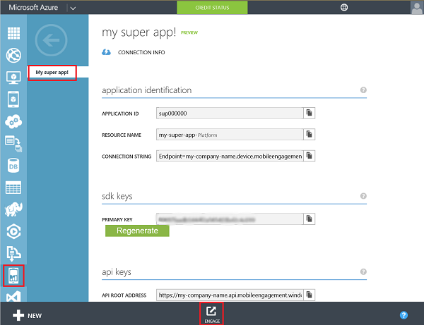
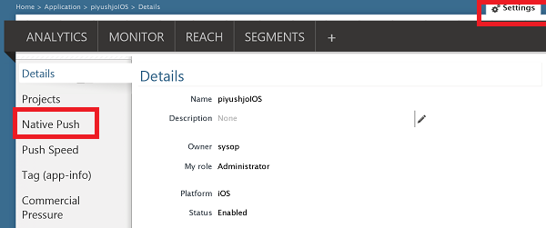
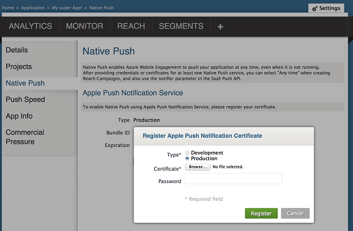
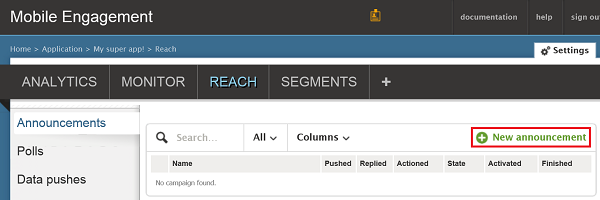
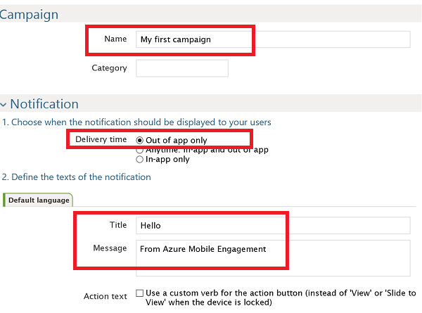

###Grant access to your Push Certificate to Mobile Engagement

To allow Mobile Engagement to send Push Notifications on your behalf, you need to grant it access to your certificate. This is done by configuring and entering your certificate into the Mobile Engagement portal. Make sure you obtain your .p12 certificate as explained in [Apple's documentation](https://developer.apple.com/library/prerelease/ios/documentation/IDEs/Conceptual/AppDistributionGuide/AddingCapabilities/AddingCapabilities.html#//apple_ref/doc/uid/TP40012582-CH26-SW6)

1. Navigate to your Mobile Engagement portal. Ensure you're in the correct and then click on the **Engage** button at the bottom:

	

2. Click on the **Settings** page in your Engagement Portal. From there click on the **Native Push** section to upload your p12 certificate:

	

3. Select your p12, upload it and type your password:

	

##Send a notification to your app

We will now create a simple Push Notification campaign that will send a push to our app:

1. Navigate to the **Reach** tab in your Mobile Engagement portal.

2. Click **New Announcement** to create your push campaign

	

3. Setup the first fields of your campaign:

	

	- 	Provide a **Name** for your campaign 
	- 	Select the **Delivery time** as **Out of app only**: this is the simple Apple push notification type that features some text.
	- 	In the notification text, type first the **Title** which will be the first line in the push.
	- 	Then type your **Message** which will be the second line

4. Scroll down, and in the content section select **Notification only**

	

5. You're done setting the most basic campaign. Now scroll down and click on **Create** button to save your push notification campaign. 

6. Finally - click on **Activate** to send push notification. 

	

 