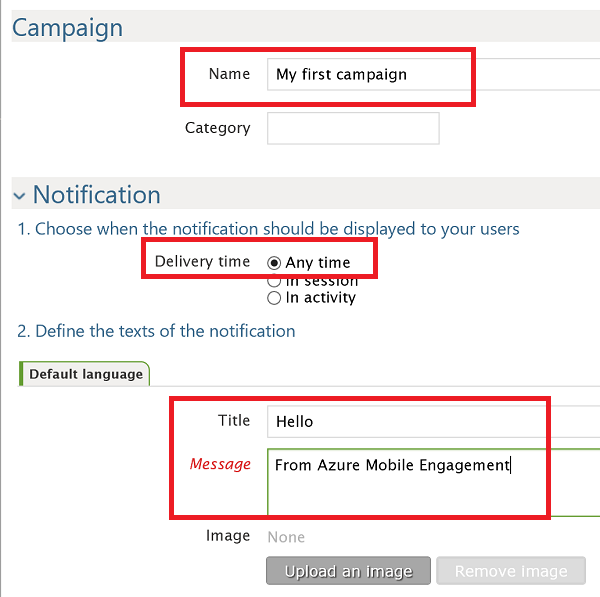
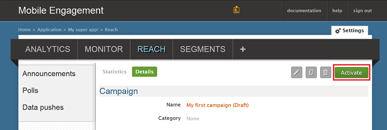

We will now create a simple push notification campaign that sends a push notification to our app.

1. Navigate to the **REACH** tab in your Mobile Engagement portal.

2. Click **New announcement** to create your push notification campaign.

	

3. Set up the first field of your campaign through the following steps:

	

	a. Provide a **Name** for your campaign.

	b. Select **Delivery time** as *Any time*.

	d. In the notification text - type the **Title** which will be in bold in the push.

	e. Then type your **Message**

4. Scroll down, and in the **Content** section, select **Notification only**.

	

5. You're done setting the most basic campaign possible. Now scroll down again and click the **Create** button to save your campaign.

6. Last step: Click **Activate** to activate your campaign and to send push notifications.

	

 