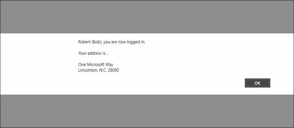

The instructions and screenshots below apply to testing a Windows Store client but, you can test this on any of the other platforms supported by Azure Mobile Services. 

1. Launch the app and authenticate with a user account that has the detailed information in the directory. 

    

2. The custom API executes returning the user's directory information for a custom greeting.

    

