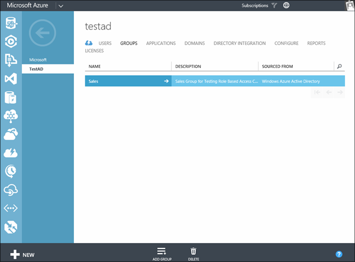
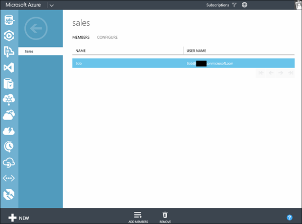
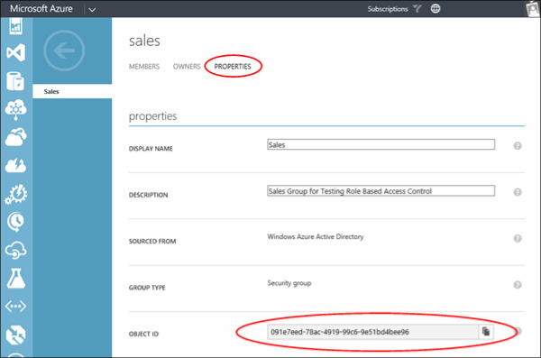
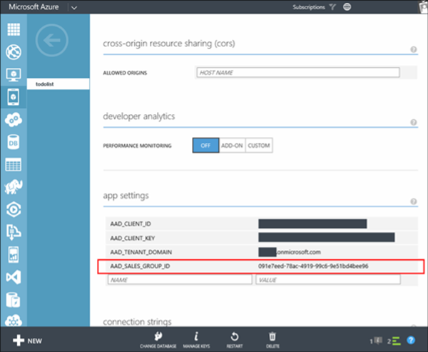

In this section you add two new users to your directory along with the new Sales group. One of the users will be granted membership to the sales group. The other user will not be granted membership to the group. 

### Create the users

1. In the [Azure Management Portal] navigate to the directory that you previously configured for authentication when you completed the tutorial to add authentication to your app.
2. Click **Users** at the top of the page. Then click the **Add User** button at the bottom. 
3. Complete the new user dialogs creating to create a user named **Bob**. Note the temporary password for the user. 
4. Create another user named **Dave**. Note the temporary password for the user.
5. The new users should look similar to what is shown below.

        

### Create the Sales group

1. On the directory page, click **Groups** at the top of the page. Then click the **Add Group** button at the bottom. 
2. Enter **Sales** for the name of the group and press the complete button on the dialog to create the group. 

    

### Add user membership to the Sales group.

1. Click **Groups** at the top of the directory page. Then click the **Sales** group to go to the sales group page. 
2. On the Sales group page, click **Add Members**. Add the user named **Bob** to the sales group. The user named **Dave** should not be a member of the group.

    

3. On the Sales group page, click **Properties**, then copy the **Object ID** for the sales group at the bottom of the page. 

   
    

4. Navigate back to your mobile service configuration page and add the object id as an app setting named **AAD\_SALES\_GROUP\_ID**. This tutorial uses group's object id as an app setting instead of looking up the id based on the group name. This is because the group name may change where the id stays the same.

    