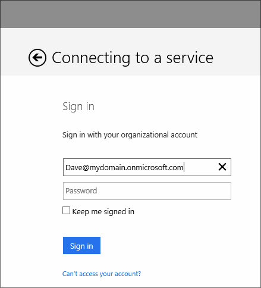
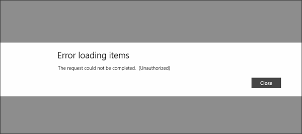
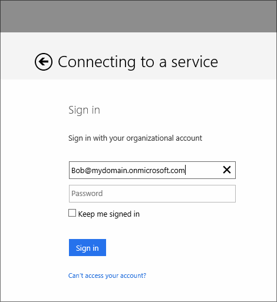

The instructions and screenshots below apply to testing a Windows Store client but, you can test this on any of the other platforms supported by Azure Mobile Services. 

1. In Visual Studio,run the client app and attempt to authenticate with the user account we created named Dave. 

    

2. Dave doesn't have membership to the Sales group. So the role based access check will denied access to the table operations. Close the client app.

    

3. In Visual Studio, run the client app again. This time authenticate with the user account we created named Bob.

    

4. Bob does have membership to the Sales group. So the role based access check will allow access to the table operations.

    

