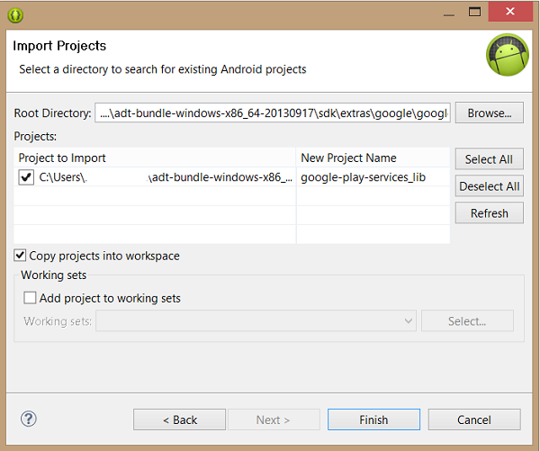
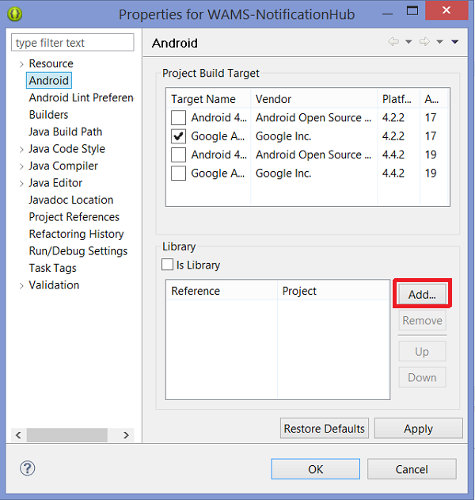

1. Open the Android SDK Manager by clicking **Window** from the top toolbar of Eclipse. Locate the target version of the Android SDK that is specified in your project properties, open it, and choose **Google APIs**.

2. Scroll down to **Extras**, expand it, and choose **Google Play Services**, as shown below. Click **Install Packages**. Note the SDK path, for use in the following step. Restart Eclipse.

   	

3. Install the Google Play Services SDK in your project. In Eclipse, click **File**, then **Import**. Select **Android**, then **Existing Android Code into Workspace**, and click **Next**. Click **Browse**, navigate to the Android SDK path (usually in a folder named `adt-bundle-windows-x86_64`), then go to the `\extras\google\google_play_services\libproject` subfolder, and there select the google-play-services-lib folder, and click **OK**. Check the **Copy projects into workspace** checkbox, and then click **Finish**.

	

5. Next you must reference the Google Play Services SDK library that you just imported, from your project. 

2. In **Package Explorer**, right-click your project and choose *Properties*.
 
3. In the Properties window, choose Android on the left.

	

5.  In the **Library** section, choose **Add** , and select the Google Play Services project (*google-play-services-lib*) and click **OK**.

6. Click **Apply** and then **OK**.

