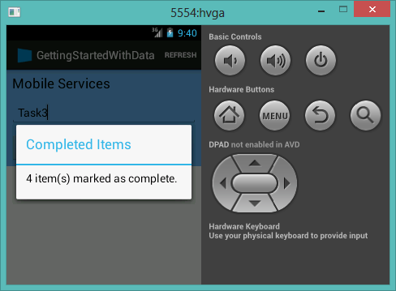

##Update the app to call the custom API

1. We will add a button labelled "Complete All" next to the existing button, and move both buttons down a line. In Android Studio, open the *res\layout\activity_to_do.xml* file in your quickstart project, locate the **LinearLayout** element that contains the **Button** element named `buttonAddToDo`. Copy the **LinearLayout** and paste it immediately following the original one. Delete the **Button** element from the first **LinearLayout**.

2. In the second **LinearLayout**, delete the **EditText** element, and add the following  code immediately following the existing **Button** element: 

        <Button
            android:id="@+id/buttonCompleteItem"
            android:layout_width="wrap_content"
            android:layout_height="wrap_content"
            android:onClick="completeItem"
            android:text="@string/complete_button_text" />

	This adds a new button to the page, on a separate line, next to the existing button.

3. The second **LinearLayout** now looks like this:

	     <LinearLayout
	        android:layout_width="match_parent" 
	        android:layout_height="wrap_content" 
	        android:background="#71BCFA"
	        android:padding="6dip"  >
	        <Button
	            android:id="@+id/buttonAddToDo"
	            android:layout_width="wrap_content"
	            android:layout_height="wrap_content"
	            android:onClick="addItem"
	            android:text="@string/add_button_text" />
	        <Button
	            android:id="@+id/buttonCompleteItem"
	            android:layout_width="wrap_content"
	            android:layout_height="wrap_content"
	            android:onClick="completeItem"
	            android:text="@string/complete_button_text" />
	    </LinearLayout>
	

4. Open the res\values\string.xml file and add the following line of code:

    	<string name="complete_button_text">Complete All</string>

5. In Project Explorer, right click the project name in the *src* folder (`com.example.{your projects name}`), choose **New** then **Class**. In the dialog, enter **MarkAllResult** in the class name field, choose OK, and replace the resulting class definition with the following code:

		import com.google.gson.annotations.SerializedName;
		
		public class MarkAllResult {
		    @SerializedName("count")
		    public int mCount;
		    
		    public int getCount() {
		        return mCount;
			}
		
			public void setCount(int count) {
			        this.mCount = count;
			}
		}

	This class is used to hold the row count value returned by the custom API. 

6. Locate the **refreshItemsFromTable** method in the **ToDoActivity.java** file, and make sure that the first line of code in the `try` block looks like this:

        final MobileServiceList<ToDoItem> result = mToDoTable.where().field("complete").eq(false).execute().get();

	This filters the items so that completed items are not returned by the query.

7. Make sure that **ToDoActivity.java** contains the following imports at the beginning of the file:

		import com.google.common.util.concurrent.FutureCallback;
		import com.google.common.util.concurrent.Futures;
		import com.google.common.util.concurrent.ListenableFuture;

8. In the **ToDoActivity.java** file, add the following method:

	public void completeItem(View view) {
	    
	    ListenableFuture<MarkAllResult> result = mClient.invokeApi( "completeAll2", MarkAllResult.class ); 
	    	
	    	Futures.addCallback(result, new FutureCallback<MarkAllResult>() {
	    		@Override
	    		public void onFailure(Throwable exc) {
	    			createAndShowDialog((Exception) exc, "Error");
	    		}
	    		
	    		@Override
	    		public void onSuccess(MarkAllResult result) {
	    			createAndShowDialog(result.getCount() + " item(s) marked as complete.", "Completed Items");
	                refreshItemsFromTable();	
	    		}
	    	});
	    }
	
	This method handles the **Click** event for the new button. The **invokeApi** method is called on the client, which sends a POST request to the new custom API. The result returned by the custom API is displayed in a message dialog, as are any errors.

## Test the app

1. From the **Run** menu, click **Run app** to start the project in the Android emulator, or in a connected Android device.

	This executes your app, built with the Android SDK, that uses the client library to send a query that returns items from your mobile service.

2. In the app, type some text in **Insert a TodoItem**, then click **Add**.

3. Repeat the previous step until you have added several todo items to the list.

4. Click the **Complete All** button.

  	

	A message dialog is displayed that indicates the number of items marked complete and the filtered query is executed again, which clears all items from the list.