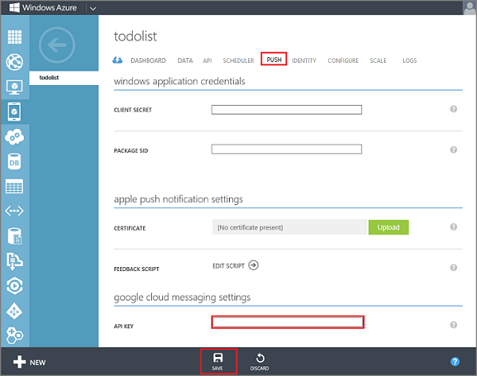

1. Log on to the [Azure Management Portal](https://manage.windowsazure.com/), click **Mobile Services**, and then click your app.

2. Click the **Push** tab, enter the **API Key** value obtained from GCM in the previous procedure, then click **Save**.

   	

    >[AZURE.NOTE]When you set your GCM credentials for enhanced push notifications in the Push tab in the portal, they are shared with Notification Hubs to configure the notification hub with your app.

Both your mobile service and your app are now configured to work with GCM and Notification Hubs. 