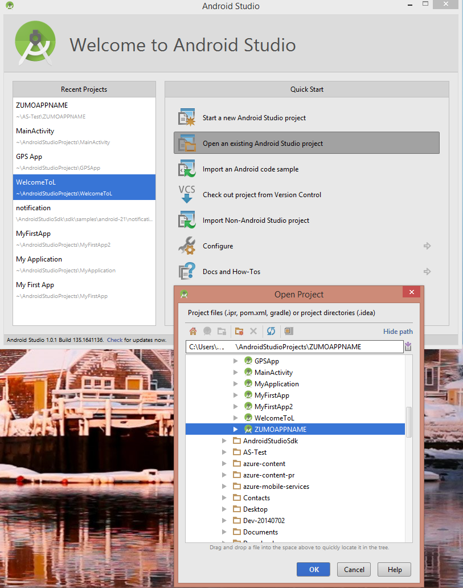
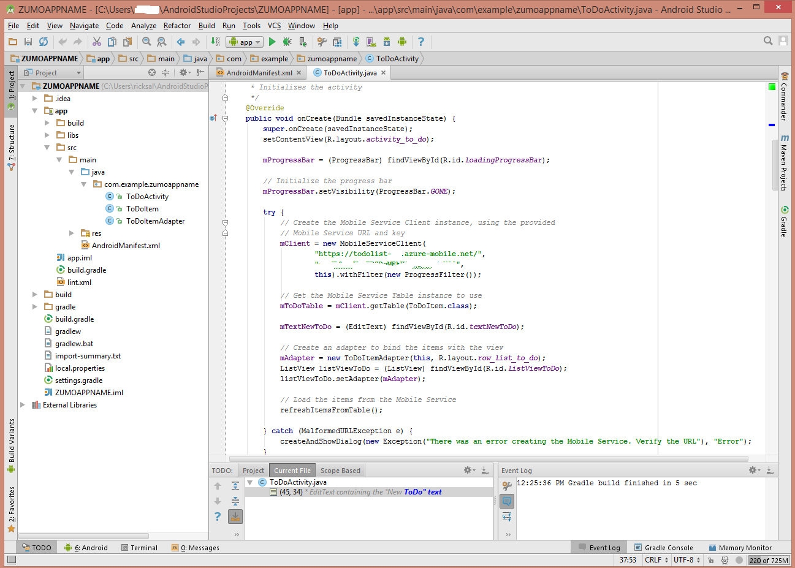

The final stage of this tutorial is to build and run your new app.

1. Browse to the location where you saved the compressed project files and expand the files on your computer into your Android Studio projects directory.

2. Open Android Studio. If you are working with a project and it appears, close the project (File => Close Project).

3. Select **Open an existing Android Studio project**, browse to the project location, and then click **OK.** 

 	

4. In the left **Project Explorer** window, ensure that the *Project* tab is selected, then open **app**, **src**, **java** and double click on **ToDoactivity**,

   	

5. If you downloaded version 2.0 of the SDK, you need to update the code with the Url and key of your mobile service:
	- 	Find the **OnCreate** method in **TodoActivity.java** and locate the code that instantiates the mobile services client. The code is visible in the preceding image.
	- 	Replace "MobileServiceUrl" with the actual Url of your mobile service.
	- 	Replace "AppKey" with the key of your mobile service.
	- 	For more details consult the tutorial [Add Mobile Services to an existing app](../articles/mobile-services/mobile-services-android-get-started-data.md). 

6. From the **Run** menu, click **Run** to start the project in the Android emulator.

	> [AZURE.IMPORTANT] To be able to run the project in the Android emulator, you must define a least one Android Virtual Device (AVD). Use the AVD Manager to create and manage these devices.

7. In the app, type meaningful text, such as _Complete the tutorial_, and then click **Add**.

   	![][10]

   	This sends a POST request to the new mobile service hosted in Azure. Data from the request is inserted into the TodoItem table. Items stored in the table are returned by the mobile service, and the data is displayed in the list.

	> [AZURE.NOTE] You can review the code that accesses your mobile service to query and insert data, which is found in the ToDoActivity.java file.

8. Back in the Management Portal, click the **Data** tab and then click the **TodoItems** table.

   	

   	This lets you browse the data inserted by the app into the table.

   	

<!-- Images. -->
[0]: ./media/mobile-services-android-get-started/mobile-quickstart-completed-android.png
[6]: ./media/mobile-services-android-get-started/mobile-portal-quickstart-android.png
[7]: ./media/mobile-services-android-get-started/mobile-quickstart-steps-android.png
[8]: ./media/mobile-services-android-get-started/Android-Studio-quickstart.png
[10]: ./media/mobile-services-android-get-started/mobile-quickstart-startup-android.png
[11]: ./media/mobile-services-android-get-started/mobile-data-tab.png
[12]: ./media/mobile-services-android-get-started/mobile-data-browse.png
[14]: ./media/mobile-services-android-get-started/android-studio-import-project.png
[15]: ./media/mobile-services-android-get-started/mobile-services-import-android-project.png

<!-- URLs. -->
[Add Mobile Services to an existing app]: ../articles/mobile-services/mobile-services-android-get-started-data.md
[Get started with authentication]: ../articles/mobile-services/mobile-services-android-get-started-users.md
[Get started with push notifications]: ../articles/mobile-services/mobile-services-javascript-backend-android-get-started-push.md
[Android SDK]: https://go.microsoft.com/fwLink/p/?LinkID=280125
[Android Studio]: https://developer.android.com/sdk/index.html
[Mobile Services Android SDK]: https://go.microsoft.com/fwLink/p/?LinkID=266533

[Management Portal]: https://manage.windowsazure.com/