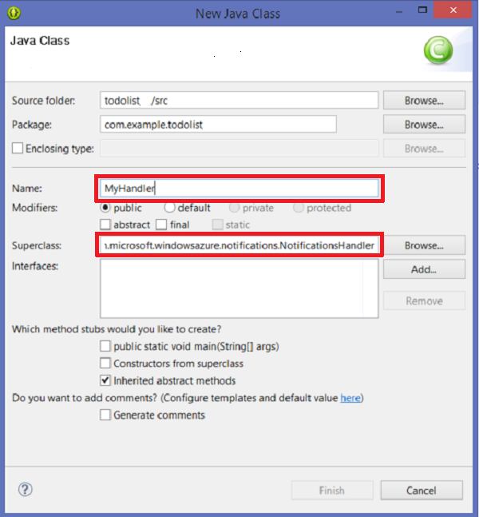

1. In your app project, open the file `AndroidManifest.xml`. In the code in the next two steps, replace _`**my_app_package**`_ with the name of the app package for your project, which is the value of the `package` attribute of the `manifest` tag. 

2. Add the following new permissions after the existing `uses-permission` element:

        <permission android:name="**my_app_package**.permission.C2D_MESSAGE" 
            android:protectionLevel="signature" />
        <uses-permission android:name="**my_app_package**.permission.C2D_MESSAGE" /> 
        <uses-permission android:name="com.google.android.c2dm.permission.RECEIVE" />
        <uses-permission android:name="android.permission.GET_ACCOUNTS" />
        <uses-permission android:name="android.permission.WAKE_LOCK" />

3. Add the following code after the `application` opening tag: 

        <receiver android:name="com.microsoft.windowsazure.notifications.NotificationsBroadcastReceiver"
            						 	android:permission="com.google.android.c2dm.permission.SEND">
            <intent-filter>
                <action android:name="com.google.android.c2dm.intent.RECEIVE" />
                <category android:name="**my_app_package**" />
            </intent-filter>
        </receiver>

4. Download and unzip the [Mobile Services Android SDK], open the **notifications** folder, copy the **notifications-1.0.1.jar** file to the *libs* folder of your Eclipse project, and refresh the *libs* folder.

    > [AZURE.NOTE] The numbers at the end of the file name may change in subsequent SDK releases.

5.  Open the file *ToDoItemActivity.java*, and add the following import statement:

		import com.microsoft.windowsazure.notifications.NotificationsManager;

6. Add the following private variable to the class: replace _`<PROJECT_NUMBER>`_ with the Project Number assigned by Google to your app in the preceding procedure:

		public static final String SENDER_ID = "<PROJECT_NUMBER>";

7. Change the definition of the *MobileServiceClient* from **private** to **public static**, so it now looks like this:

		public static MobileServiceClient mClient;

9. Next we need to add a new class to handle notifications. In the Package Explorer, right-click the package (under the `src` node), click **New**, click **Class**.

10. In **Name** type `MyHandler`, in **Superclass** type `com.microsoft.windowsazure.notifications.NotificationsHandler`, then click **Finish**

	

	This creates the new MyHandler class.

11. Add the following import statements for the `MyHandler` class:

		import android.app.NotificationManager;
		import android.app.PendingIntent;
		import android.content.Context;
		import android.content.Intent;
		import android.os.AsyncTask;
		import android.os.Bundle;
		import android.support.v4.app.NotificationCompat;

	
12. Next add the following members for the `MyHandler` class:

		public static final int NOTIFICATION_ID = 1;
		private NotificationManager mNotificationManager;
		NotificationCompat.Builder builder;
		Context ctx;

13. In the `MyHandler` class, add the following code to override the **onRegistered** method, which registers your device with the mobile service Notification Hub.

		@Override
		public void onRegistered(Context context,  final String gcmRegistrationId) {
		    super.onRegistered(context, gcmRegistrationId);
	
		    new AsyncTask<Void, Void, Void>() {
		    		    	
		    	protected Void doInBackground(Void... params) {
		    		try {
		    		    ToDoActivity.mClient.getPush().register(gcmRegistrationId, null);
		    		    return null;
	    		    }
	    		    catch(Exception e) { 
			    		// handle error    		    
	    		    }
					return null;  		    
	    		}
		    }.execute();
		}

14. In the `MyHandler` class, add the following code to override the **onReceive** method, which causes the notification to display when it is received.

		@Override
		public void onReceive(Context context, Bundle bundle) {
		    ctx = context;
		    String nhMessage = bundle.getString("message");
	
		    sendNotification(nhMessage);
		}
	
		private void sendNotification(String msg) {
			mNotificationManager = (NotificationManager)
		              ctx.getSystemService(Context.NOTIFICATION_SERVICE);
	
		    PendingIntent contentIntent = PendingIntent.getActivity(ctx, 0,
		          new Intent(ctx, ToDoActivity.class), 0);
	
		    NotificationCompat.Builder mBuilder =
		          new NotificationCompat.Builder(ctx)
		          .setSmallIcon(R.drawable.ic_launcher)
		          .setContentTitle("Notification Hub Demo")
		          .setStyle(new NotificationCompat.BigTextStyle()
		                     .bigText(msg))
		          .setContentText(msg);
	
		     mBuilder.setContentIntent(contentIntent);
		     mNotificationManager.notify(NOTIFICATION_ID, mBuilder.build());
		}

15. Back in the TodoActivity.java file, update the **onCreate** method of the *ToDoActivity* class to register the notification handler class. Make sure to add this code after the *MobileServiceClient* is instantiated.

		NotificationsManager.handleNotifications(this, SENDER_ID, MyHandler.class);

    Your app is now updated to support push notifications.

<!-- URLs. -->
[Mobile Services Android SDK]: http://aka.ms/Iajk6q
