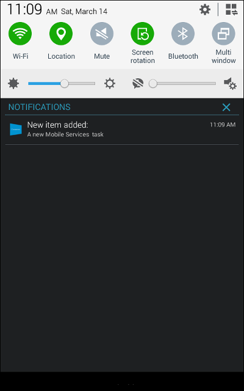

###Setting up the Android emulator for testing
When you run this app in the emulator, make sure that you use an Android Virtual Device (AVD) that supports Google APIs.

> [AZURE.IMPORTANT] In order to receive push notifications, you must set up a Google account on your Android Virtual Device (in the emulator, navigate to **Settings** and click **Add Account**). Also, make sure that the emulator is connected to the Internet.

1. From **Tools**, click **Open Android Emulator Manager**, select your device, and then click **Edit**.

   	

2. Select **Google APIs** in **Target**, then click **OK**.

   	

3. On the top toolbar, click **Run**, and then select your app. This starts the emulator and runs the app.

  The app retrieves the *registrationId* from GCM and registers with the Notification Hub.

###Inserting a new item generates a notification.

1. In the app, type meaningful text, such as _A new Mobile Services task_ and then click the **Add** button.

2. Swipe down from the top of the screen to open the device's Notification Center to see the notification.

	