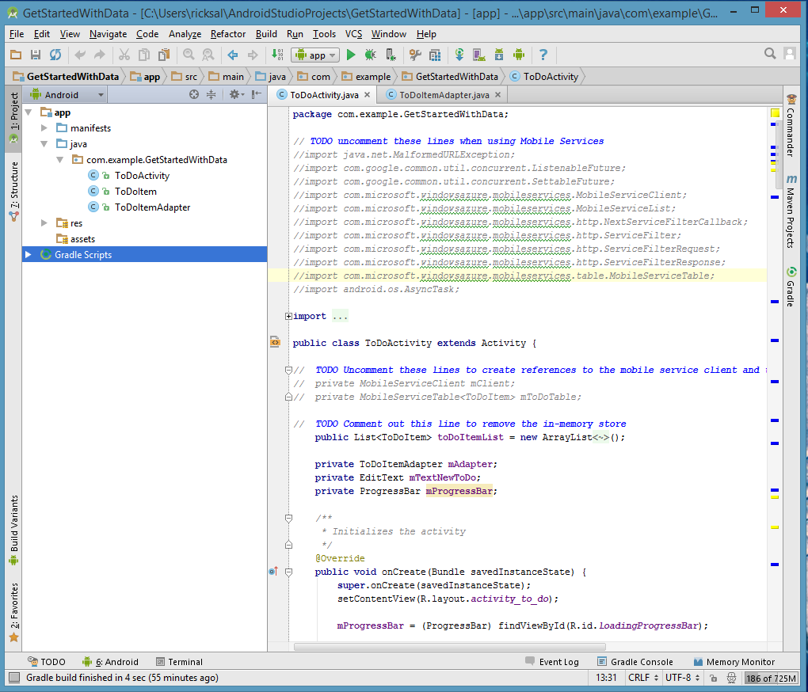
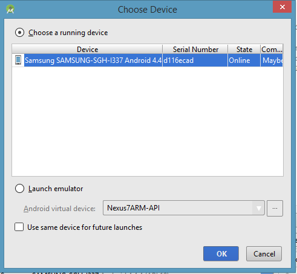

1. In Project Explorer, expand **app** => **src** => **main** => **java** => **com.example.GetStartedWithData** and then open the *ToDoActivity.java* file.

   	

   	Notice that there are `//TODO` comments that specify the steps you must take to make this app work with your mobile service.

2. From the **Run** menu, click **Run app**.

3. The **Choose Device** dialog will appear.

	

	> [AZURE.NOTE] You can run this project using an Android phone, or using the Android emulator. Running with an Android phone  requires you to download a phone-specific USB driver.
	>
	> To run the project in the Android emulator, you must define a least one Android Virtual Device (AVD). Use the AVD Manager to create and manage these devices.

4. Choose either a connected device, or *Launch Emulator*.

5. When the app appears, type meaningful text, such as _Complete the tutorial_, and then click **Add**.

   	

   	Notice that the saved text is stored in an in-memory collection and displayed in the list below.