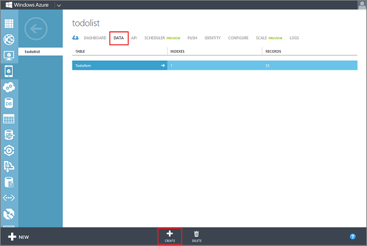
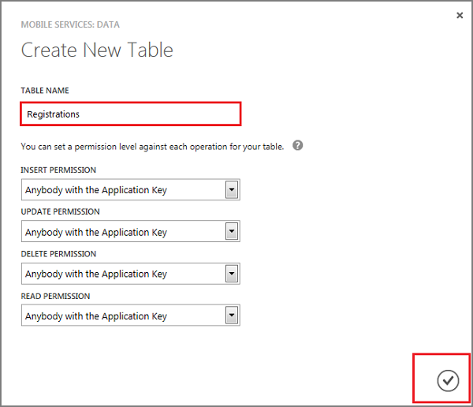

1. Log into the [Azure Management Portal], click **Mobile Services**, and then click your app.

	

2. Click the **Data** tab, and then click **Create**.

	

	This displays the **Create new table** dialog.

3. Keeping the default **Anybody with the application key** setting for all permissions, type _Registrations_ in **Table name**, and then click the check button.

	

  This creates the **Registrations** table, which stores the channel URIs used to send push notifications.

Next, you will modify the your app to enable push notifications.

<!-- URLs -->
[Azure Management Portal]: https://manage.windowsazure.com/
