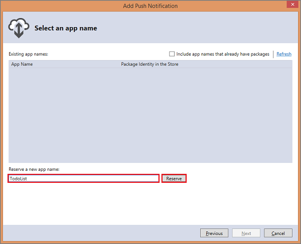
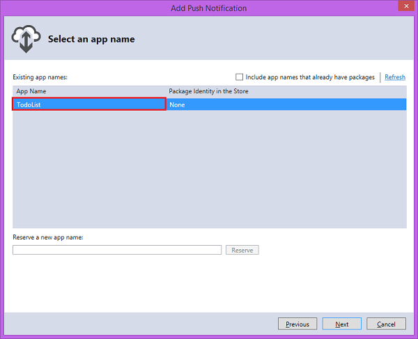

First, you use the Add Push Notification wizard in Visual Studio 2013 to register your app with the Windows Store, configure your mobile service to enable push notifications, and add code to your app to register a device channel.

0. If you haven't already done so, follow the steps in [Import your publishsettings file in Visual Studio 2013] to import your publisher.settings file into Visual Studio. 

	You do not need to do this if you have already used Visual Studio to create or manage mobile services in your Azure subscription.

1. In Visual Studio 2013, open Solution Explorer, right-click the project, click **Add** then **Push Notification...**. 

	

	This starts the Add Push Notification Wizard.

2. Click **Next**, sign in to your Windows Store account, then supply a name in **Reserve a new name** and click **Reserve**.

	 

	This create a new app registration.

3. Click the new registration in the **App Name** list, then click **Next**.

	

4. In the **Select a service** dialog, click the name of the mobile service that you created when you completed either [Get started with Mobile Services] or [Get started with data], then click **Next** and **Finish**. 

	
	The mobile service is updated to register your app package SID and client secret and a new **channels** table is created. Mobile Services is now configured to work with Windows Push Notification Services (WNS) to be able to send notifications to your app.   

	
<b>Note</b>
		
When your app isn't already configured to connect to the mobile service, the wizard also completes the same configuration tasks demonstrated in <strong>Get started with data</strong>.

	

<!-- URLs. -->
[Get started with Mobile Services]: /en-us/develop/mobile/tutorials/get-started/
[Get started with data]: /en-us/develop/mobile/tutorials/get-started-with-data-dotnet/
[Import your publishsettings file in Visual Studio 2013]: /en-us/documentation/articles/mobile-services-windows-how-to-import-publishsettings/
