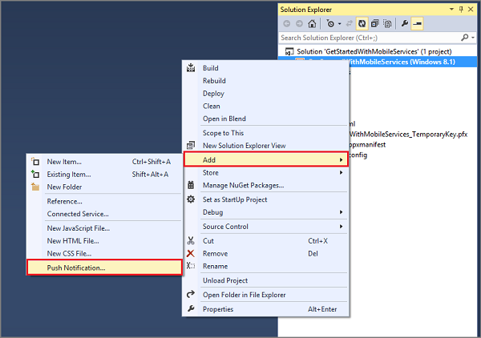

The following steps registers your app with the Windows Store, configure your mobile service to enable push notifications, and add code to your app to register a device channel with your notification hub. Visual Studio 2013 connects to Azure and to the Windows Store by using the credentials that you provide. 

1. In Visual Studio 2013, open Solution Explorer, right-click the Windows Store app project, click **Add** then **Push Notification...**. 

	

	This starts the Add Push Notification Wizard.

2. Click **Next**, sign in to your Windows Store account, then supply a name in **Reserve a new name** and click **Reserve**.

	This creates a new app registration.

3. Click the new registration in the **App Name** list, then click **Next**.

4. In the **Select a service** page, click the name of your mobile service, then click **Next** and **Finish**. 

	The notification hub used by your mobile service is updated with the Windows Notification Services (WNS) registration. You can now use Azure Notification Hubs to send notifications from Mobile Services to your app by using WNS. 

	>[AZURE.NOTE]This tutorial demonstrates sending notifications from a mobile service backend. You can use the same notification hub registration to send notifications from any backend service. For more information, see [Notification Hubs Overview](http://msdn.microsoft.com/library/azure/jj927170.aspx).

5. When you complete the wizard, a new **Push setup is almost complete** page is opened in Visual Studio. This page details an alternate method to configure your mobile service project to send notifications that is different from this tutorial. 

	The code that is added to your universal Windows app solution by the Add Push Notification wizard is platform-specific. Later in this section, you will remove this redundancy by sharing the Mobile Services client code, which makes the universal app easier to maintain.  

<!-- URLs. -->
[Get started with Mobile Services]: /develop/mobile/tutorials/get-started/
[Get started with data]: /develop/mobile/tutorials/get-started-with-data-dotnet/
[Import your publishsettings file in Visual Studio 2013]: ../articles/mobile-services-windows-how-to-import-publishsettings.md
