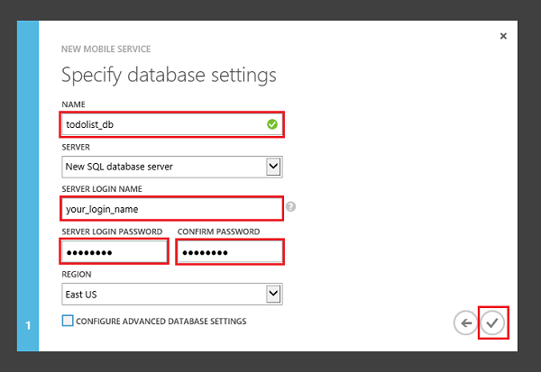

Next, you will create a new mobile service to replace the in-memory list for data storage. Follow these steps to create a new mobile service.

1. Log into the [Azure Management Portal](https://manage.windowsazure.com/). 
2.	At the bottom of the navigation pane, click **+NEW**.

	

3.	Expand **Compute** and **Mobile Service**, then click **Create**.

	

    This displays the **New Mobile Service** dialog.

4.	In the **Create a mobile service** page, select **Create a free 20 MB SQL Database**, then type a subdomain name for the new mobile service in the **URL** textbox and wait for name verification. Once name verification completes, click the right arrow button to go to the next page.	

	

    This displays the **Specify database settings** page.

    
	> [AZURE.NOTE] As part of this tutorial, you create a new SQL Database instance and server. You can reuse this new database and administer it as you would any other SQL Database instance. If you already have a database in the same region as the new mobile service, you can instead choose **Use existing Database** and then select that database. The use of a database in a different region is not recommended because of additional bandwidth costs and higher latencies.

5.	In **Name**, type the name of the new database, then type **Login name**, which is the administrator login name for the new SQL Database server, type and confirm the password, and click the check button to complete the process.

	

    
	> [AZURE.NOTE] When the password that you supply does not meet the minimum requirements or when there is a mismatch, a warning is displayed.  
	>
	> We recommend that you make a note of the administrator login name and password that you specify; you will need this information to reuse the SQL Database instance or the server in the future.

You have now created a new mobile service that can be used by your mobile apps. Next, you will add a new table in which to store app data. This table will be used by the app in place of the in-memory collection.

