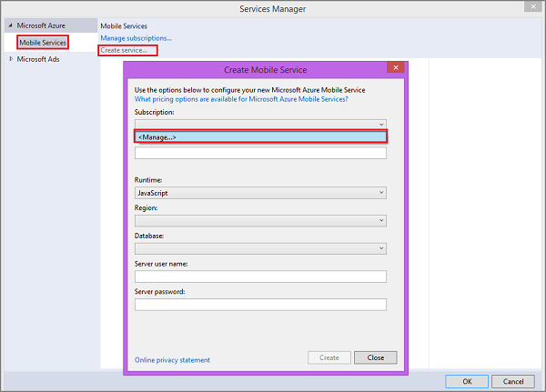
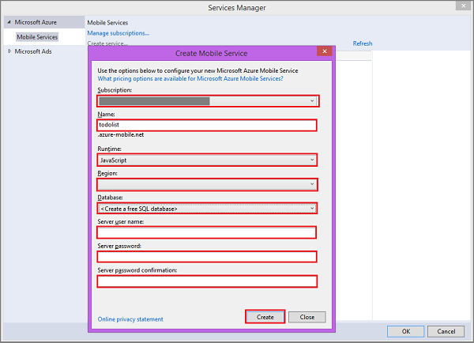

The following steps create a new mobile service in Windows Azure and add code to your project that enables access to this new service. Before you can create the mobile service, you must import the publishsettings file from your Windows Azure subscription into Visual Studio. This enables Visual Studio to connect to Windows Azure on your behalf. When you create a new mobile service, you must specify a Windows Azure SQL Database that is used by the mobile service to store app data. 

1. In Visual Studio 2013, open Solution Explorer, right-click the project then click **Add** and then **Connected Service...**. 

	

2. In the Services Manager dialog, click **Create service...**, then select **&lt;Import...&gt;** from  **Subscription** in the Create Mobile Service dialog.  

	

3. In Import Windows Azure Subscriptions, click **Download subscription file**, login to your Windows Azure account (if required), click **Save** when your browser requests to save the file.

	

	
<strong>Note</strong> 
The login window is displayed in the browser, which may be behind your Visual Studio window. Remember to make a note of where you saved the downloaded .publishsettings file. You can skip this step if your project is already connected to your Windows Azure subscription.

 

4. Click **Browse**, navigate to the location where you saved the .publishsettings file, select the file, then click **Open** and then **Import**. 

	

	Visual Studio imports the data needed to connect to your Windows Azure subscription. When your subscription already has one or more existing mobile services, the service names are displayed. 

	
<strong>Security note</strong> 
After importing the publish settings, consider deleting the downloaded .publishsettings file as it contains information that can be used by others to access your account. Secure the file if you plan to keep it for use in other connected app projects.

5. Back in the **Create Mobile Service** dialog, select your **Subscription** and the desired **Region** for your mobile service, then type a **Name** for your mobile service.

	
<strong>Note</strong> 
Mobile service names must be unique. A red X is displayed next to <strong>Name</strong> when the name you supplied is not available. 

		

6. In **Database**, select **&lt;Create a free SQL Database&gt;**, supply the **Server user name**, **Server password**, and **Server password confirmation** then click **Create**.

  

> WACOM.NOTE
> As part of this tutorial, you create a new free SQL Database instance and server. You can reuse this new database and administer it as you would any other SQL Database instance. You can only have one free database instance. If you already have a database in the same region as the new mobile service, you can instead choose the existing database. When you choose an existing database, make sure that you supply correct login credentials. If you supply incorrect login credentials, the mobile service is created in an unhealthy state.

   After the mobile service is created, a reference to the Mobile Services client library is added to the project and your project source code is updated.

