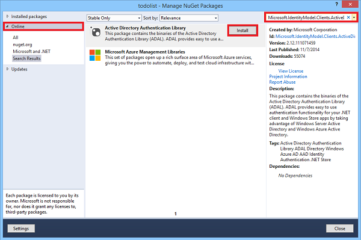

1. In the Solution Explorer window of Visual Studio, right click the project and click **Manage NuGet Packages**.

2. In the NuGet Package manager, click **Online**. Enter **Microsoft.IdentityModel.Clients.ActiveDirectory** as a search term. Then click **Install** to install the Active Directory Authentication Library Nuget package. 

   
