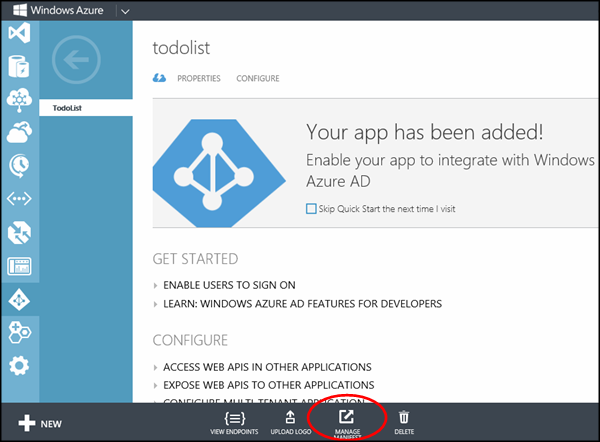

## Register your mobile service with the Azure Active Directory

In this section you will register your mobile service with the Azure Active Directory and configure permissions to allow single sign-on impersonation.

1. Register your application with your Azure Active Directory by following the [How to Register with the Azure Active Directory] topic.

2. In the [Azure Management Portal], go back to the Azure Active Directory extension and click on your active directory

3. Click the **Applications** tab and then click your application.

4. Click **Manage Manifest**. Then click **Download Manifest** and save the application manifest to a local directory.

   

5. Open the application manifest file with Visual Studio. At the top of the file find the app permissions line that looks as follows:

        "oauth2Permissions": [],

    Replace that line with the following app permissions and save the file.

        "oauth2Permissions": [
            {
                "adminConsentDescription": "Allow the application access to the mobile service",
                "adminConsentDisplayName": "Have full access to the mobile service",
                "id": "b69ee3c9-c40d-4f2a-ac80-961cd1534e40",
                "isEnabled": true,
                "origin": "Application",
                "type": "User",
                "userConsentDescription": "Allow the application full access to the mobile service on your behalf",
                "userConsentDisplayName": "Have full access to the mobile service",
                "value": "user_impersonation"
            }
        ],

6. In the Azure Management portal, click **Manage Manifest** for the application again and click **Upload Manifest**.  Browse to the location of the application manifest that you just updated and upload the manifest.

<!-- URLs. -->
[How to Register with the Azure Active Directory]: ../articles/mobile-services/mobile-services-how-to-register-active-directory-authentication.md
[Azure Management Portal]: https://manage.windowsazure.com/