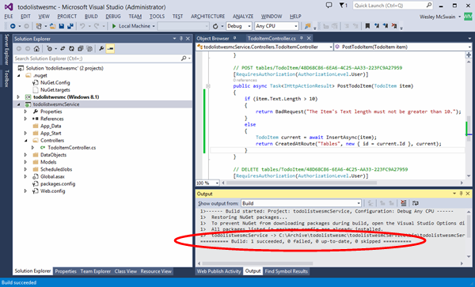
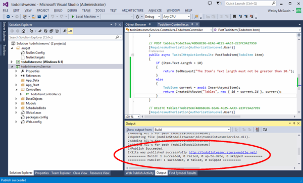

It is always a good practice to validate the length of data that is submitted by users. In this section you will add code to the mobile service that validates the length of string data sent to the mobile service and rejects strings that are too long, in this case longer than 10 characters.

1. Start Visual Studio with the **Run as administrator** option and open the solution that contains the mobile service project that you worked with in the [Getting Started] or [Get started with data](../articles/mobile-services-dotnet-backend-windows-store-dotnet-get-started-data.md)  tutorial.

2. In the Solution Explorer window expand the todo list service project and expand **Contollers**. Open the TodoItemController.cs file which is part of the mobile service project.  

   	

3. Replace the `PostTodoItem` method with the following method which will validate that the text string is not greater than 10 characters. For items that do have a text length greater than 10 characters, the method returns an HTTP Status code 400 Bad Request with a descriptive message included as content.

        public async Task<IHttpActionResult> PostTodoItem(TodoItem item)
        {
            if (item.Text.Length > 10)
            {
                return BadRequest("The Item's Text length must not be greater than 10.");
            }
            else
            {
                TodoItem current = await InsertAsync(item);
                return CreatedAtRoute("Tables", new { id = current.Id }, current);
            } 
        }

4. Right click the service project and click **Build** to build the mobile service project. Verify no errors occurred.

   	

5. Right click the service project and click **Publish**. Publish the mobile service to your Microsoft Azure account using the publishing settings you previously used in the [Getting Started] or [Get started with data](../articles/mobile-services-dotnet-backend-windows-store-dotnet-get-started-data.md)  tutorial.
 
     >[AZURE.NOTE] You can alternatively test with the service hosted locally in IIS Express. For more information see the [Get started with data](../articles/mobile-services-dotnet-backend-windows-store-dotnet-get-started-data.md) tutorial.

    

<!-- URLs. -->
[Getting Started]: ../articles/mobile-services/mobile-services-dotnet-backend-windows-store-dotnet-get-started.md
