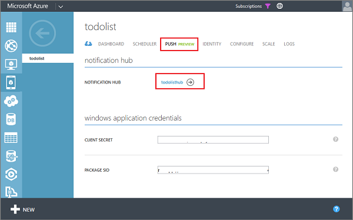
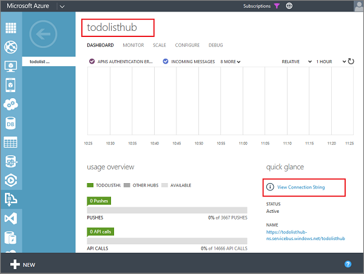
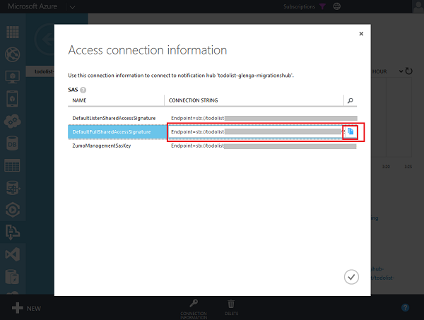

You can optionally test push notifications with your mobile service running on the local computer or VM before you publish to Azure. To do this, you must set information about the notification hub used by your app in the web.config file. This information is only used when running locally to connect to the notification hub; it is ignored when published to Azure.

1. Back in the **Push** tab of your mobile service, click the **Notification Hub** link.

	

	This navigates to the notification hub used by your mobile service.

2. In the notification hub page, make a note of the name of your notification hub, then click **View Connection String**.

	

3. In the **Access connection information**, copy the **DefaultFullSharedAccessSignature** connection string.

	

4. In your mobile service project in Visual Studio, open the Web.config file for the service and in **connectionStrings**, replace the connection string for **MS_NotificationHubConnectionString** with the connection string from the previous step.

5. In **appSettings**, replace the value of the **MS_NotificationHubName** app setting with the name of the notification hub.

Now, the mobile service project is configured to connect to the notification hub in Azure when running locally. Note that it is important to use the same notification hub name and connection string as the portal because these Web.config project settings are overridden by the portal settings when running in Azure.