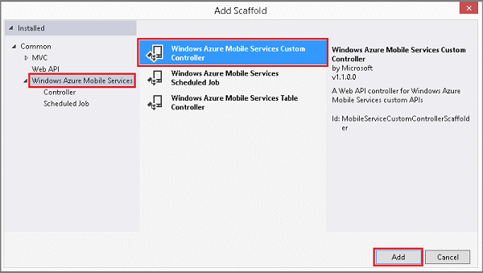

1. In Visual Studio, right-click the Controllers folder, expand **Add**, then click **New Scaffolded Item**. This displays the Add Scaffold dialog.

2. Expand **Azure Mobile Services**, click **Azure Mobile Services Custom Controller**,  click **Add**, supply a **Controller name** of `CompleteAllController`, and click **Add** again.

	

	This creates a new empty controller class named **CompleteAllController**.

	>[AZURE.NOTE]If your dialog doesn't have Mobile Services-specific scaffolds, instead create a new **Web API Controller - Empty**. In this new controller class, add a public **Services** property, which returns the **ApiServices** type. This property is used to access server-specific settings from inside your controller.

3. In **CompleteAllController.cs**, add the following **using** statements. 	Replace `todolistService` with the namespace of your mobile service project, which should be the mobile service name appended with `Service`.

		using System.Threading.Tasks;
		using todolistService.Models;

4. In **CompleteAllController.cs**, add the following class to wrap the response sent to the client.

        // We use this class to keep parity with other Mobile Services
        // that use the JavaScript backend. This way the same client
        // code can call either type of Mobile Service backend.
        public class MarkAllResult
        {
            public int count;
        }

5. Add the following code to the new controller. Replace `todolistContext` with the name of the DbContext for your data model, which should be the mobile service name appended with `Context`. Similarly, replace the schema name in the UPDATE statement with the name of your mobile service. This code uses the [Database Class](http://msdn.microsoft.com/library/system.data.entity.database.aspx) to access the **TodoItems** table directly to set the completed flag on all items. This method supports a POST request, and the number of changed rows is returned to the client as an integer value.

	    // POST api/completeall
        public async Task<MarkAllResult> Post()
        {
            using (todolistContext context = new todolistContext())
            {
                // Get the database from the context.
                var database = context.Database;

                // Create a SQL statement that sets all uncompleted items
                // to complete and execute the statement asynchronously.
                var sql = @"UPDATE todolist.TodoItems SET Complete = 1 " +
                            @"WHERE Complete = 0; SELECT @@ROWCOUNT as count";

                var result = new MarkAllResult();
                result.count = await database.ExecuteSqlCommandAsync(sql);

                // Log the result.
                Services.Log.Info(string.Format("{0} items set to 'complete'.",
                    result.count.ToString()));

                return result;
            }
        }

	> [AZURE.NOTE] With default permissions, anyone with the app key may call the custom API. However, the application key is not considered a secure credential because it may not be distributed or stored securely. Consider restricting access to only authenticated users for additional security.
