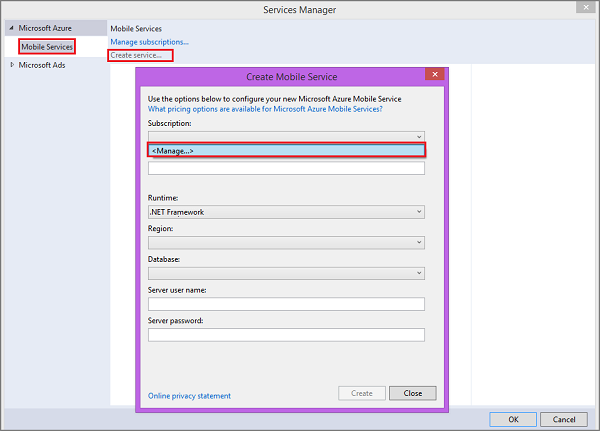
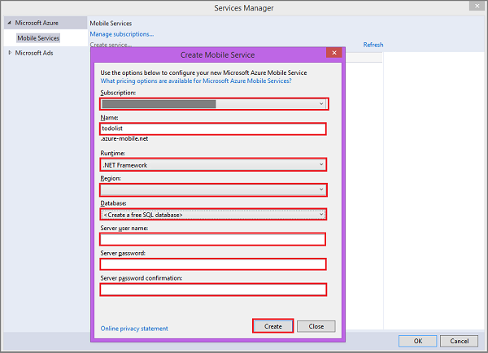

The following steps create a new mobile service in Azure and add code to your project that connects your app to this new service. Visual Studio 2013 connects to Azure on your behalf to create the new mobile service by using the credentials that you provide. When you create a new mobile service, you must specify an Azure SQL Database that is used by the mobile service to store app data. 

1. In Visual Studio 2013, open Solution Explorer, right-click the Windows Store app project, click **Add**, and then click **Connected Service...**. 

2. In the Services Manager dialog, click **Create service...**, then select **&lt;Manage...&gt;** from  **Subscription** in the Create Mobile Service dialog.  

	

3. In Manage Microsoft Azure Subscriptions, click **Sign In...** to sign in to your Azure account (if required), select an available subscription, then click **Close**.

	When your subscription already has one or more existing mobile services, the service names are displayed. 

5. Back in the **Create Mobile Service** dialog, select your **Subscription**, the **.NET Framework** backend  in **Runtime** and a **Region** for your mobile service, then type a **Name** for your mobile service.

	>[AZURE.NOTE]Mobile service names must be unique. A red X is displayed next to **Name** when the name you supplied is not available. 

6. In **Database**, select **&lt;Create a free SQL Database&gt;**, supply the **Server user name**, **Server password**, and **Server password confirmation** then click **Create**.

  	

	> [AZURE.NOTE]
	> As part of this tutorial, you create a new free SQL Database instance and server. You can reuse this new database and administer it as you would any other SQL Database instance. You can only have one free database instance. If you already have a database in the same region as the new mobile service, you can instead choose the existing database. When you choose an existing database, make sure that you supply correct login credentials. If you supply incorrect login credentials, the mobile service is created in an unhealthy state.

7. After the mobile service is created, select the newly created mobile service from the list in Service Manager and click **OK**.
 
   	After the wizard completes, the mobile service project is added to your solution, the required NuGet packages are installed, a reference to the Mobile Services client library is added to the project, and your project source code is updated.

