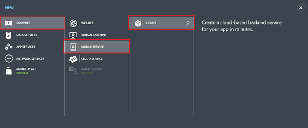
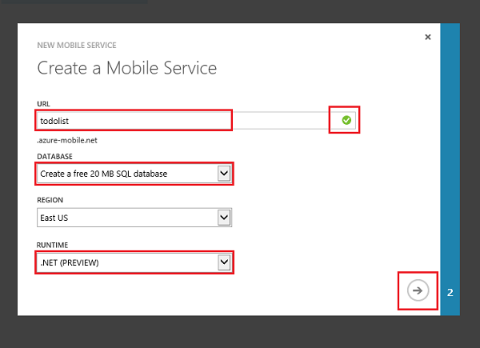

Follow these steps to create a new mobile service.

1.	Log into the [Management Portal]. 

2.	At the bottom of the navigation pane, click **+NEW**.

	

3.	Expand **Compute** and **Mobile Service**, then click **Create**.

	

	This displays the **New Mobile Service** dialog.

4.	In the **Create a mobile service** page, select **Create a free 20 MB SQL Database**, select **.NET** runtime, then type a subdomain name for the new mobile service in the **URL** textbox and wait for name verification. Once name verification completes, click the right arrow button to go to the next page.	

	

   	This displays the **Specify database settings** page.

	
 
	<b>Note</b> 
	
As part of this tutorial, you create a new SQL Database instance and server. You can reuse this new database and administer it as you would any other SQL Database instance. If you already have a database in the same region as the new mobile service, you can instead choose <strong>Use existing Database</strong> and then select that database. The use of a database in a different region is not recommended because of additional bandwidth costs and higher latencies.

	

6.	In **Name**, type the name of the new database, then type **Login name**, which is the administrator login name for the new SQL Database server, type and confirm the password, and click the check button to complete the process.

	

	
 
	<b>Note</b> 
	
When the password that you supply does not meet the minimum requirements or when there is a mismatch, a warning is displayed.  We recommend that you make a note of the administrator login name and password that you specify; you will need this information to reuse the SQL Database instance or the server in the future.
 
	

You have now created a new mobile service that can be used by your mobile apps.

<!-- URLs. -->
[Management Portal]: https://manage.windowsazure.com/
