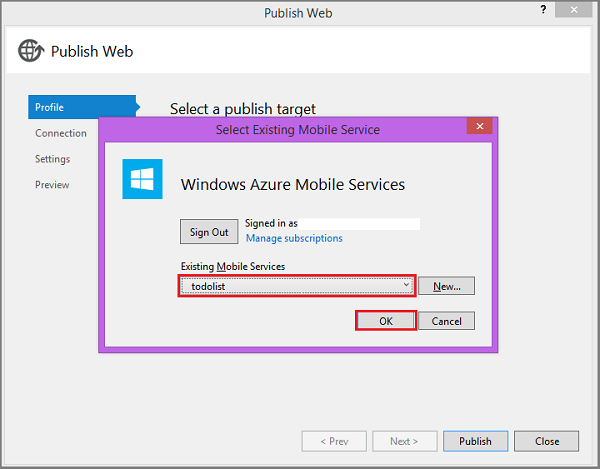
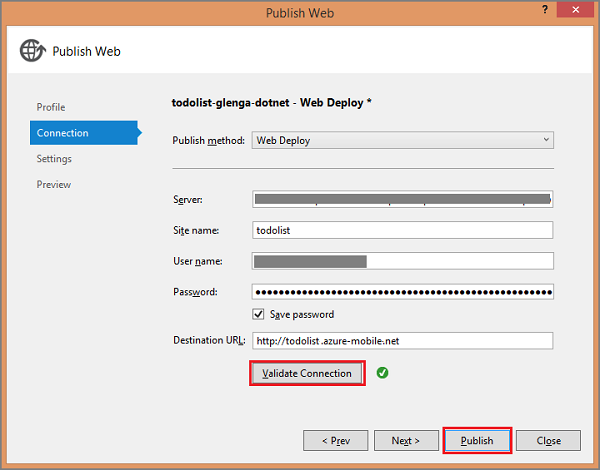

After testing the client app against the local mobile service, the final stage of this tutorial is to publish the mobile service to Azure and run the app against the live service.

>[AZURE.NOTE] This procedure shows how to publish your mobile service by using Visual Studio tools. You can also publish your .NET backend mobile service by using source control. For more information, see [Store project code in source control](../articles/mobile-services-dotnet-backend-store-code-source-control.md).

1. In Solution Explorer, right-click the mobile service project, click **Publish**, then in the **Publish Web** dialog box click **Azure Mobile Services**.

2. Sign in with your Azure account credentials, select your service from **Existing Mobile Services**, and click **OK**. Visual Studio downloads your publish settings directly from Azure.

	

3. Click **Validate connection** to verify that publishing is correctly configured, then click **Publish**.

	

	After publishing succeeds, you will again see the confirmation page that the mobile service is up and running, this time in Azure.
