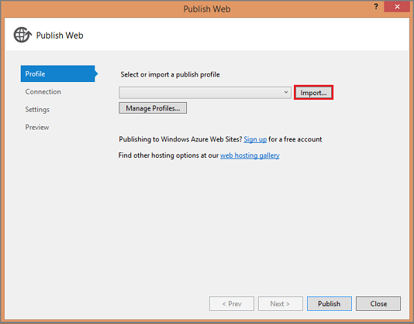
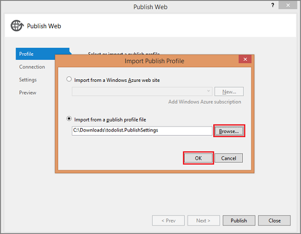

After testing the Windows Store app against the local mobile service, the final stage of this tutorial is to publish the mobile service to Azure and run the app against the live service.

1. In Solution Explorer, right-click the mobile service project and click **Publish**

	

	This displays the Publish Web dialog box.

2. Click **Import**, click **Browse**, navigate to the location where you earlier saved the publish profile file, Select the publish profile file, click **OK**.

	

	This loads the information needed by Visual Studio to publish your mobile service to Azure. 
	
	
<strong>Security note</strong> 
After importing the publish profile, consider deleting the downloaded file as it contains information that can be used by others to access your services.

3. Click **Validate connection** to verify that publishing is correctly configured, then click **Publish**.

	

	After publishing succeeds, you will again see the confirmation page that the mobile service is up and running, this time in Azure.

