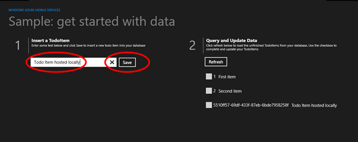
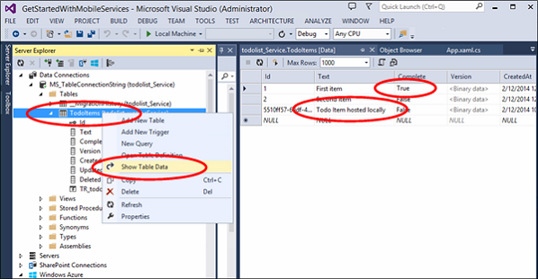

In this section you will use Visual Studio to host the mobile service locally on your development workstation in IIS Express. Then you will test the app and the backend service.

1. In Visual Studio, press the F7 key or click **Build Solution** from the **Build** menu to build both the Windows Store app and the mobile service. Verify both projects build with no errors in the output window of Visual Studio

2. In Visual Studio, press the F5 key or click **Start Debugging** from the **Debug** menu to run the app and host the mobile service locally in IIS Express. 

 
3. Enter a new todoitem's text. Then click **Save**. This inserts a new todoItem in the database created by the mobile service hosted locally in IIS Express. 

    

4. Click the checkbox for one of the items to mark it as completed.

    

5. In Visual Studio you can view the changes in the database created for the backend service by opening Server Explorer and expanding the Data Connections. Right click the TodoItems table under **MS_TableConnectionString** and click **Show Table Data**

    