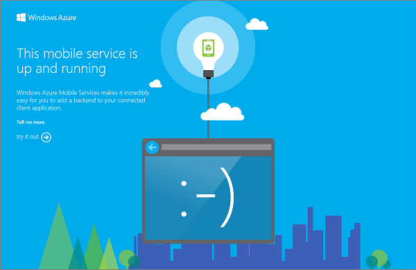

The mobile service project that you download lets you to run your new mobile service right on your local computer or virtual machine. This makes it easy to debug your service code before you even publish it to Azure.

1. Browse to the location where you saved the compressed project files, expand the files on your computer, and open the solution file in Visual Studio.

2. Press the **F5** key to rebuild the project and start the mobile service locally.

	

	A web page is displayed after the mobile service starts successfully.