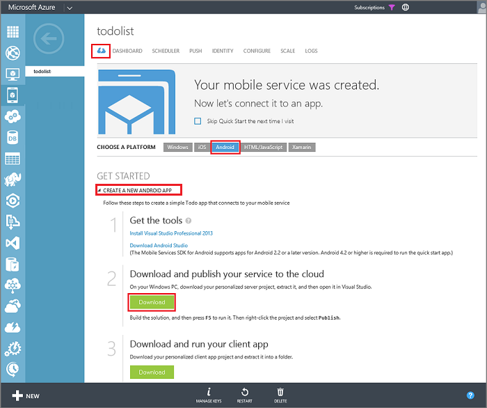

1. If you haven't already done so, download and install [Visual Studio Professional 2013](https://go.microsoft.com/fwLink/p/?LinkID=391934), or a later version.
 
2. In the [Azure Management Portal](https://manage.windowsazure.com/), click your new Mobile Service and in the quickstart page click the **Android** platform, then under **Get Started**, expand **Create a new Android app**. 

    

4. Under **Download and publish your service to the cloud**, click **Download**.

	This downloads the Visual Studio project that implements your mobile service. Save the compressed project file to your local computer, and make a note of where you saved it.

