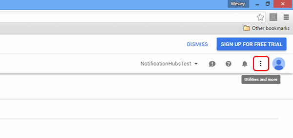
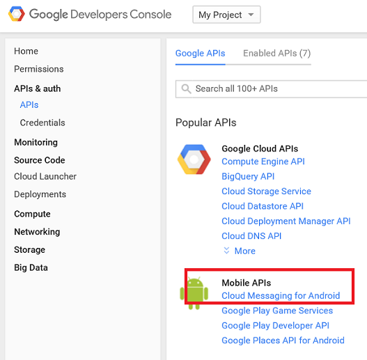
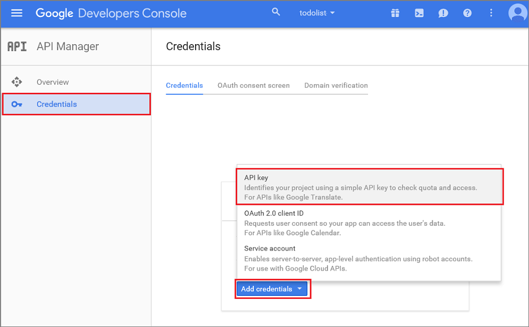

1. Navigate to the [Google Cloud Console](https://console.developers.google.com/project), sign in with your Google account credentials. 
 
2. Click **Create Project**, type a project name, then click **Create**. If requested, carry out the SMS Verification, and click **Create** again.

   	   

	 Type in your new **Project name** and click **Create project**.

3. Click the **Utilities and More** button and then click **Project Information**. Make a note of the **Project Number**. You will need to set this value as the `SenderId` variable in the client app.

   	

4. In the project dashboard, under **Mobile APIs**, click **Google Cloud Messaging**, then on the next page click **Enable API** and accept the terms of service. 

	

	 

5. In the project dashboard, Click **Credentials** > **Create Credential** > **API Key**. 

   	

6. In **Create a new key**, click **Server key**, type a name for your key, then click **Create**.

7. Make a note of the **API KEY** value.

	You will use this API key value to enable Azure to authenticate with GCM and send push notifications on behalf of your app.

