1. Navigate to the [Google Cloud Console](https://console.developers.google.com/cloud-resource-manager), sign in with your Google account credentials. 
2. Select **Create Project** on the toolbar. 
   
    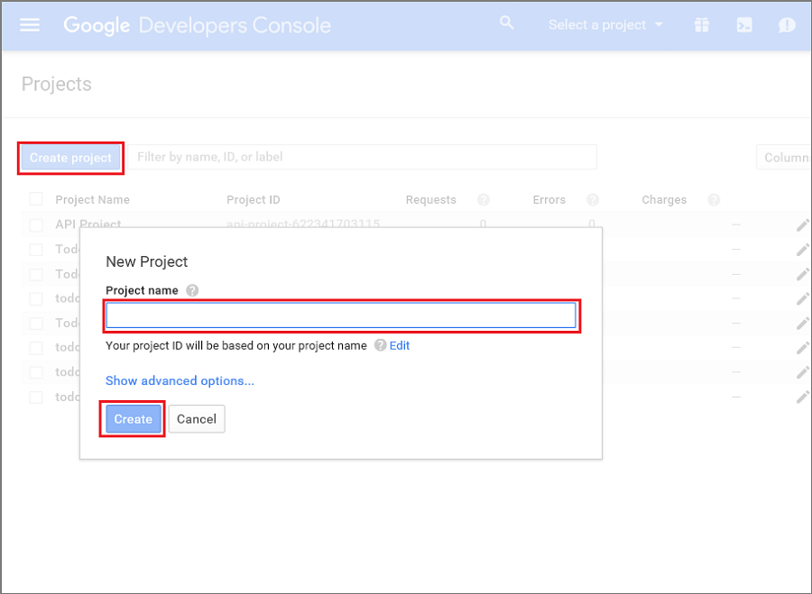   
3. For **Project name**, enter a name for your project, and click **Create**.
4. Select the **alerts** button on the toolbar, and select your project in the list. You see the dashboard for your project. You can also navigate directly to the dashboard by using the URL: `https://console.developers.google.com/home/dashboard?project=<YOUR PROJECT NAME>`

    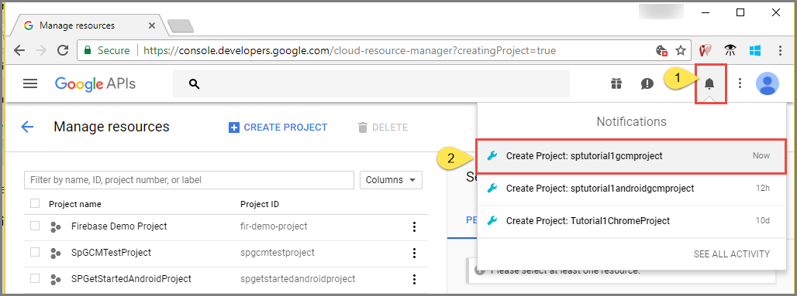
5. Note down the **Project number** in the **Project info** tile of the dashboard. 

    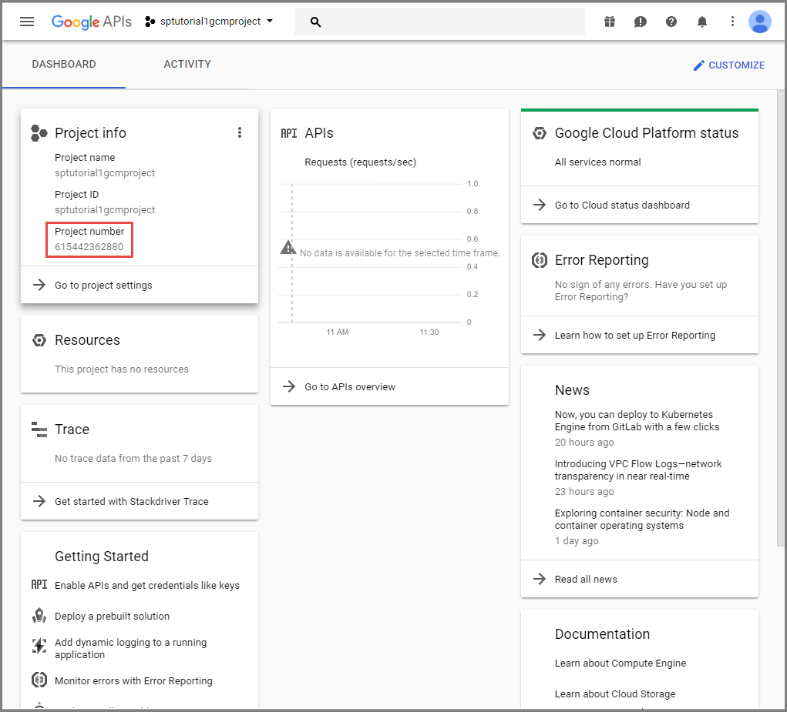
6. In the dashboard, on the **APIs** tile, select **Got to APIs overview**. 

    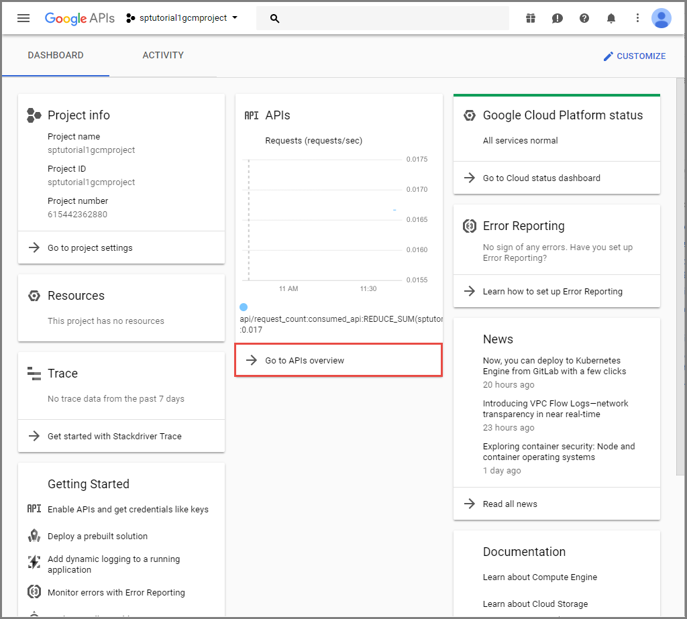
7. On the **API** page, select **ENABLE APIS AND SERVICES**. 

    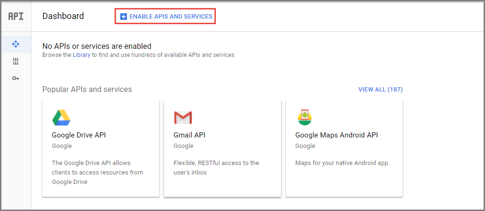
8. Search for and select **Google Cloud Messaging**. 

    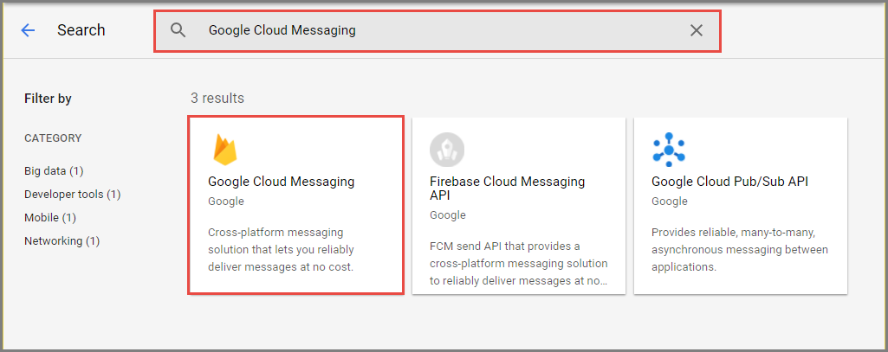
9. To enable Google Cloud Messaging for the project, select **ENABLE**.

    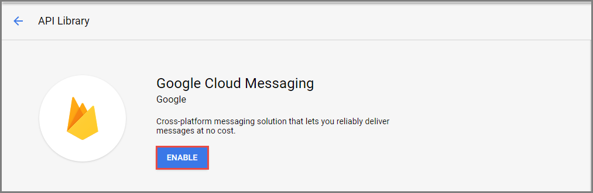
10. Select **Create credentials** on the toolbar. 

    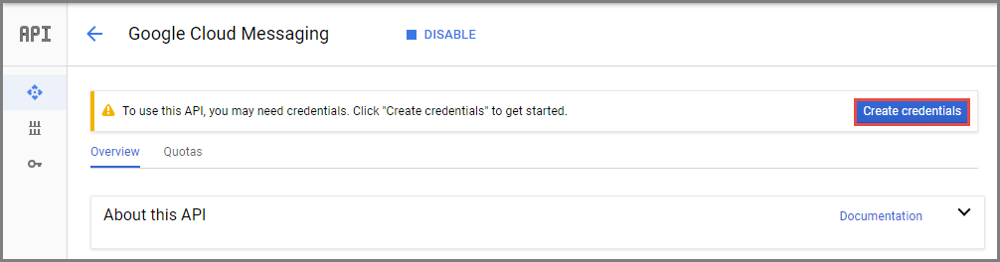
11. On the **Add credentials to your project** page, select **API key** link. 

    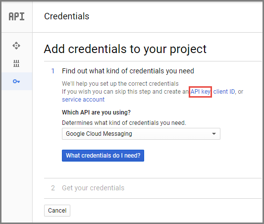    
12. On **API key** page, select **Create/Save**. In the following example, the **IP addresses** option is selected, and **0.0.0.0/0** is entered for allowed IP addresses. You should restrict your API key appropriately. 

    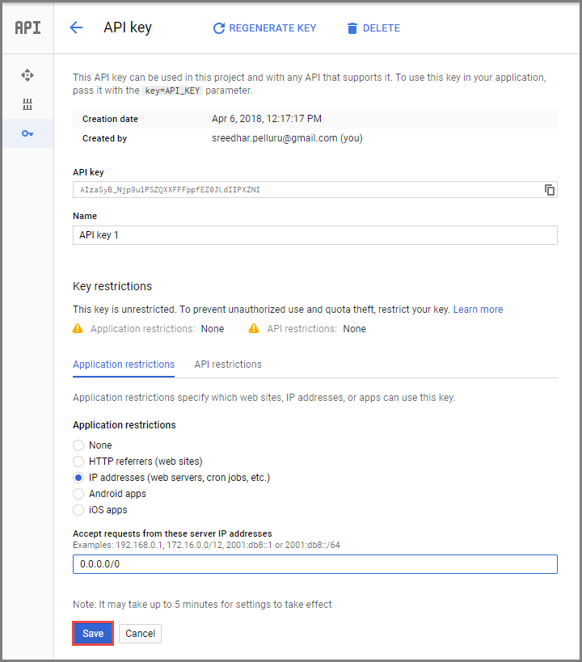
13. Copy the **API key** to the clipboard, and save it somewhere. 

    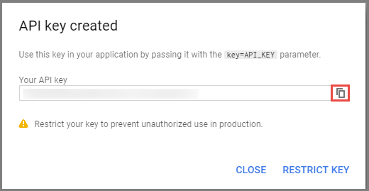
   
    You will use this API key value to enable Azure to authenticate with GCM and send push notifications on behalf of your app. To navigate back to the project dashboard, use the URL: `https://console.developers.google.com/home/dashboard?project=<YOUR PROJECT NAME>`

