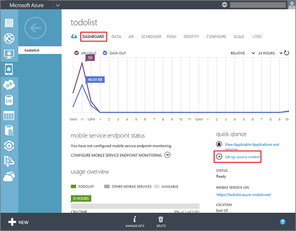
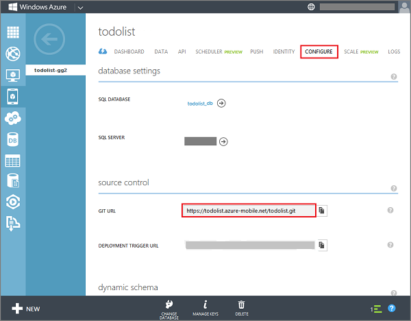

1. Log on to the [Azure Management Portal], click **Mobile Services**, click your mobile service, then click the **Dashboard** tab.

2. (Optional) If you have already set the Mobile Services or Websites source control credentials for your Azure subscription, then you can skip down to step 4. Otherwise, click **Set up source control** under **Quick glance** and click **Yes** to confirm.

	

3. Supply a **User name**, **New password**, confirm the password, then click the check button. 

	The Git repository is created in your mobile service. Make a note of the credentials you just supplied; you will use them to access this and other Mobile Services repositories in your subscription.

4. Click the **Configure** tab and notice the **Source control** fields.

	

	The URL of the Git repository is displayed. You will use this URL to clone the repository to your local computer.

With source control enabled in your mobile service, you can use Git to clone the repository to your local computer.
 