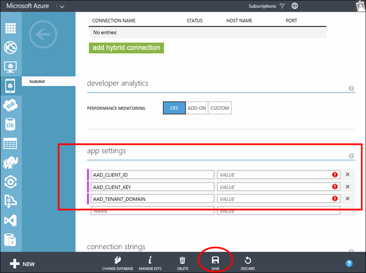

1. Click **Applications** tab on your directory page in the [Azure Management Portal](https://manage.windowsazure.com/).
  
2. Click your integrated application registration.

3. Click **Configure** on the application page and scroll down the the **keys** section of the page. 
4. Click **1 year** duration for a new key. Then click **Save** and the portal will display your new key value.
5. Copy the **Client ID** and **Key** shown after you save. Note that the key value will only be shown to you a single time after you have saved. 

    

6. Scroll down to the bottom of the integrated application configuration page and enable the **Read directory data** permission for the application and click **Save**.

    

7. In the [Azure Management Portal](https://manage.windowsazure.com/) navigate back to your mobile service and click the **Configure** tab. Scroll down to the **app settings** section and add the following app settings and click **Save**. 

    <table border="1">
    <tr>
    <th>App Setting Name</th><th>Description</th>
    </tr>
    <tr>
    <td>AAD_CLIENT_ID</td><td>The client id you copied from your integrated app in the steps above.</td>
    </tr>
    <tr>
    <td>AAD_CLIENT_KEY</td><td>The app key you generated in your AAD integrated app in the steps above.</td>
    </tr>
    <tr>
    <td>AAD_TENANT_DOMAIN</td><td>Your AAD domain name. Should be similar to "mydomain.onmicrosoft.com"</td>
    </tr>
    </table> 

 
    
  