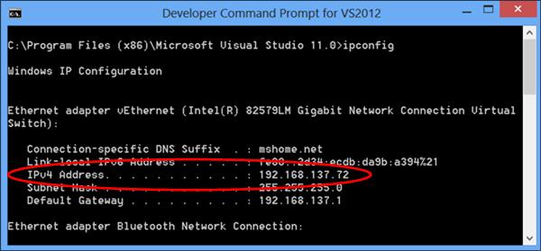

1. Make sure to stop the mobile service if it is currently running in IIS Express. Right click the IIS Express tray icon and click **stop** for the mobile service.

    

2. In a command prompt window, run the **ipconfig** command to look up a valid local IP address for your workstation.

    

3. In Visual Studio, open the applicationhost.config file for IIS Express. This file is located in the following subdirectory of your user profile directory.

        C:\Users\<your profile name>\Documents\IISExpress\config\applicationhost.config

4. Configure IIS Express to allow remote connection requests to the service. To do this, in the applicationhost.config file, find the site element for your mobile service and add a new `binding` element for the port using the IP address you noted above. Then save the applicationhost.config file. 

    Your updated site element should look similar to the following:

        <site name="todolist_Service(1)" id="2">
            <application path="/" applicationPool="Clr4IntegratedAppPool">
                <virtualDirectory path="/" physicalPath="C:\Archive\GetStartedDataWP8\C#\todolist_Service" />
            </application>
            <bindings>
                <binding protocol="http" bindingInformation="*:58203:localhost" />
                <binding protocol="http" bindingInformation="*:58203:192.168.137.72" />
            </bindings>
        </site>

5. Open the Windows Firewall console and create a new port rule to allow connections to the port. For more information on creating a new Windows Firewall port rule, see [How to add a new Windows Firewall port rule].

    >[AZURE.NOTE] If your test machine is joined to a domain, firewall exceptions may be controlled by a domain policy. In this case, you would need to contact your domain adminstrator to get an exemption for the port on your machine.

    You should now be configured to test with IIS Express hosting your mobile service. 

    >[AZURE.NOTE] Once you finish your testing of the service locally, you should delete the Windows Firewall rule you created. 

<!-- URLs. -->
[How to add a new Windows Firewall port rule]:  http://go.microsoft.com/fwlink/?LinkId=392240
