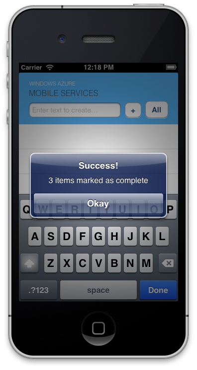

<h2>Update the app Update the app to call the custom API</h2>

1. Create a button, so you can click it to call the custom API. Drag a **Round Rect Button** from the **Object Library** located at the bottom of the **Utilities** pane, and place it below or next to the text field. Double-click to add the text **"All"**. 

	This adds a new button **"All"**.

2. Open the **QSTodoService.m** code file, locate the `refreshDataOnSuccess` method and make sure that it contains the following code:

		- (void)refreshDataOnSuccess:(QSCompletionBlock)completion
		{		   
		    // Create a predicate that finds items where complete is false
		    NSPredicate * predicate = [NSPredicate predicateWithFormat:@"complete == NO"];
		    
		    // Query the TodoItem table and update the items property with the results from the service
		    [self.table readWithPredicate:predicate completion:^(NSArray *results, NSInteger totalCount, NSError *error)
		    {
		        [self logErrorIfNotNil:error];
		        
		        items = [results mutableCopy];
		        
		        // Let the caller know that we finished
		        completion();
		    }];		    		    		    
		}

	This filters the items so that completed items are not returned by the query.

3. Now it's time to connect this object to the view controller source code. **Control-click** the new **"All"** button, and drag the mouse over to before the `@end` line in **QSTodoListViewController.h**. Connect the object to a new **Action** named `onCompleteAll` in **QSTodoListViewController**. Xcode will automatically insert the following line before the `@end` line:

		   - (IBAction)onCompleteAll:(id)sender;

4. The goal of this `onCompleteAll` method is to handle the Click event for the new button. It invokes a new `completeAll` method that we will add to our custom class, which in turn sends a POST request to the new custom API. The result returned by the custom API is displayed in a message dialog, as are any errors. Edit **QSTodoListViewController.m** to add the following implementation before the `@end` line:

		   - (IBAction)onCompleteAll:(id)sender {
		    [self.todoService completeAll:^(id result, NSHTTPURLResponse* response, NSError* error)
		     {
		         if (error)
		         {
		             NSString* errorMessage = @"There was a problem! ";
		             errorMessage = [errorMessage stringByAppendingString:[error localizedDescription]];
		             UIAlertView* myAlert = [[UIAlertView alloc]
		                                     initWithTitle:@"Error!"
		                                     message:errorMessage
		                                     delegate:nil
		                                     cancelButtonTitle:@"Okay"
		                                     otherButtonTitles:nil];
		             [myAlert show];
		             [self refresh];
		         } else {
		             NSString* successMessage = [NSString stringWithFormat:@"%d items marked as complete", [[result objectForKey:@"count"] integerValue]];					 
		             UIAlertView* myAlert = [[UIAlertView alloc]
		                                     initWithTitle:@"Success!"
		                                     message:successMessage
		                                     delegate:nil
		                                     cancelButtonTitle:@"Okay"
		                                     otherButtonTitles:nil];
		             [myAlert show];
		             [self refresh];
		         }
		     }];
  		   }

5. Notice that the code above refers to a new method `completeAll` that has not yet been defined in **QSTodoService**. Edit **QSTodoService.h** and add the following line before the `@end` line:

		- (void) completeAll:(MSAPIBlock)completion;

6. Add the corresponding implementation of `completeAll` in **QSTodoService.m** before the `@end` line. iOS is similar to JavaScript in that it doesn't support JSON serialization of arbitrary types. As such, it has quite a simple API for invoking custom APIs as well, consisting of the `invokeAPI` method. 

		- (void) completeAll:(MSAPIBlock)completion
		{
		    [self.client
		     invokeAPI:@"completeall"
		     body:nil
		     HTTPMethod:@"POST"
		     parameters:nil
		     headers:nil
		     completion:completion ];
		}

## Test the app

1. In Xcode, select an emulator to deploy to (either iPhone or iPad), press the **Run** button (or the **Command+R** key) to rebuild the project and start the app. This executes your Windows Azure Mobile Services client, built with the iOS SDK, that queries items from your mobile service.

2. Type text in the text field, and then click the **+** button. This sends a new item as an insert to the mobile service.

3. Repeat the previous step until you have added several items to the list.

4. Tap the **All** button. An alert box is displayed that indicates the number of items marked complete and the filtered query is executed again, which clears all items from the list.

  	
