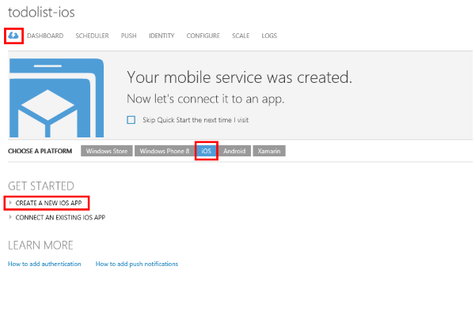
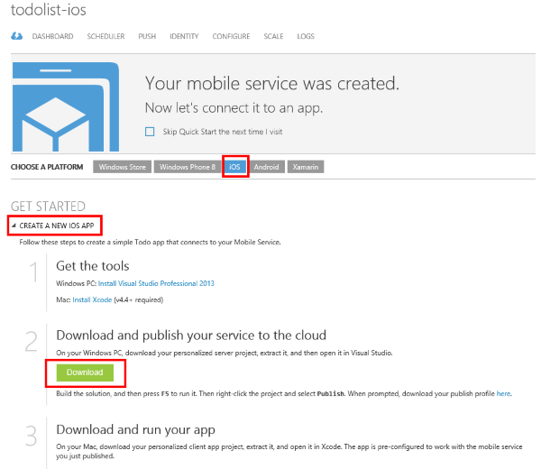
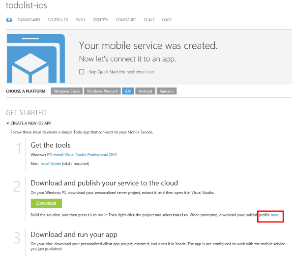

1. In the [Azure Management Portal], click your new Mobile Service or its cloud icon tab to go to the overview page.

    

2. Click the **iOS** platform. Under the **Get Started** section, and expand **Create a new iOS app**. 

    

3. If you haven't already done so, download and install [Visual Studio Professional 2013](https://go.microsoft.com/fwLink/p/?LinkID=391934), or a later version.

4. Click **Download** under **Download and publish your service to the cloud**.

	This downloads the Visual Studio project that implements your mobile service. Save the compressed project file to your local computer, and make a note of where you saved it.

5. Scroll down to the bottom of that **Get Started** section to the step titled **Download and publish your service to the cloud**. Click the link shown in the screenshot below to download a publish profile file for the mobile service you just downloaded. 

    > [AZURE.NOTE] Save the file in a safe place because it does contain sensitive information pertaining to your Azure account. You will delete this file after publishing the mobile service later in this tutorial. 

    

<!-- URLs. -->
[Azure Management Portal]: https://manage.windowsazure.com/

