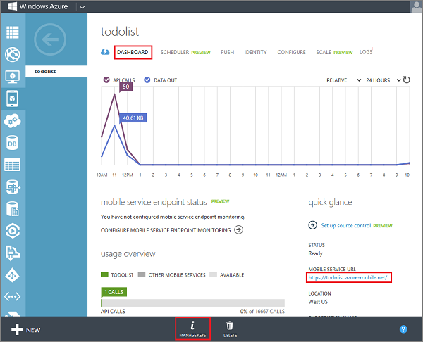

Now that your mobile service is ready, you can update the app to store items in Mobile Services instead of the local collection. 

1. If you haven't already installed the [Mobile Services iOS SDK](https://go.microsoft.com/fwLink/p/?LinkID=266533), install it now.

2. In the Project Navigator in Xcode, open both the TodoService.m and TodoService.h files located in the Quickstart folder, and add the following import statement: 

        #import <WindowsAzureMobileServices/WindowsAzureMobileServices.h>  

3. In the ToDoService.h file, locate the following commented line of code:

        // Create an MSClient property comment in the #interface declaration for the TodoService. 

   	After this comment, add the following line of code:

        @property (nonatomic, strong)   MSClient *client;

   	This creates a property that represents the MSClient that connects to the service

4. In the file TodoService.m, locate the following commented line of code:

        // Create an MSTable property for your items. 

   	After this comment, add the following line of code inside the @interface declaration:

        @property (nonatomic, strong)   MSTable *table;

   	This creates a property representation for your mobile services table.

5. In the Management Portal, click **Mobile Services**, and then click the mobile service you just created.

6. Click the **Dashboard** tab and make a note of the **Site URL**, then click **Manage keys** and make a note of the **Application key**.

   	

  	You will need these values when accessing the mobile service from your app code.

7. Back in Xcode, open TodoService.m and locate the following commented line of code:

        // Initialize the Mobile Service client with your URL and key.

    After this comment, add the following line of code:

        self.client = [MSClient clientWithApplicationURLString:@"APPURL" withApplicationKey:@"APPKEY"];

    This creates an instance of the Mobile Services client.

8. Replace the values of **APPURL** and **APPKEY** in this code with the URL and application key from the mobile service that you acquired in step 6.

9. Locate the following commented line of code:

        // Create an MSTable instance to allow us to work with the TodoItem table.

    After this comment, add the following line of code:

        self.table = [self.client getTable:@"TodoItem"];

    This creates the TodoItem table instance.

10. Locate the following commented line of code:

 	    // Create a predicate that finds items where complete is false comment in the refreshDataOnSuccess method. 

    After this comment, add the following line of code:

        NSPredicate * predicate = [NSPredicate predicateWithFormat:@"complete == NO"];

    This creates a query to return all tasks that have not yet been completed.

11. Locate the following commented line of code:

        // Query the TodoItem table and update the items property with the results from the service.

   	Replace that comment and the subsequent **completion** block invocation with the following code:

        // Query the TodoItem table and update the items property with the results from the service
        [self.table readWhere:predicate completion:^(NSArray *items, NSInteger totalCount, NSError *error)
		{
		   self.items = [items mutableCopy];
           completion();
        }]; 

12. Locate the **addItem** method, and add the following code to the body of the method:

        // Insert the item into the TodoItem table and add to the items array on completion
        [self.table insert:item completion:^(NSDictionary *result, NSError *error) {
            NSUInteger index = [items count];
            [(NSMutableArray *)items insertObject:item atIndex:index];
 
            // Let the caller know that we finished
            completion(index);
        }];

    This code sends an insert request to the mobile service.

13. Locate the **completeItem** method, and add the following code to the body of the method:

        // Update the item in the TodoItem table and remove from the items array on completion
        [self.table update:mutable completion:^(NSDictionary *item, NSError *error) {
    
            // TODO
            // Get a fresh index in case the list has changed
            NSUInteger index = [items indexOfObjectIdenticalTo:mutable];
    
            [mutableItems removeObjectAtIndex:index];
    
            // Let the caller know that we have finished
            completion(index);
	    }]; 

   	This code removes TodoItems after they are marked as completed. 

Now that the app has been updated to use Mobile Services for backend storage, it's time to test the app against Mobile Services.
