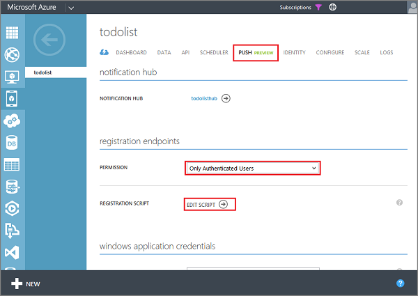

1. Log on to the [Azure Management Portal], click **Mobile Services**, and then click your mobile service.

   	

2. Click the **Push** tab, select **Only Authenticated Users** for **Permissions**, then click **Edit Script**.

   	
	
	This allows you to customize the push notification registration callback function. If you use Git to edit your source code, this same registration function is found in `.\service\extensions\push.js`.

3. Replace the existing **register** function with the following code:

		exports.register = function (registration, registrationContext, done) {   
		    // Get the ID of the logged-in user.
			var userId = registrationContext.user.userId;    
		    
			// Perform a check here for any disallowed tags.
			
		    // Add a new tag that is the user ID.
		    registration.tags.push(userId);
		    
		    done();
		}; 

	This adds a tag to the registration that is the ID of the logged-in user. When a notification is sent to this user, it is recieved on this device.

4. Click the back arrow, click the **Data** tab, click **TodoItem**, click **Script** and select **Insert**. 