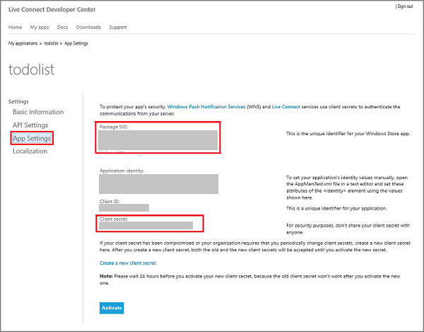
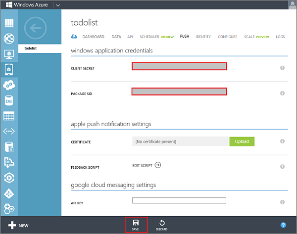

1. If you have not already registered your app, navigate to the [Submit an app page] at the Dev Center for Windows Store apps, log on with your Microsoft account, and then click **App name**.

   	

2. Type a name for your app in **App name**, click **Reserve app name**, and then click **Save**.

   	

   	This creates a new Windows Store registration for your app.

3. In Visual Studio 2012 Express for Windows 8, open the project that you created when you completed the tutorial [Get started with Mobile Services].

4. In solution explorer, right-click the project, click **Store**, and then click **Associate App with the Store...**. 

  	

   	This displays the **Associate Your App with the Windows Store** Wizard.

5. In the wizard, click **Sign in** and then login with your Microsoft account.

6. Select the app that you registered in step 2, click **Next**, and then click **Associate**.

   	

   	This adds the required Windows Store registration information to the application manifest.    

7. Back in the Windows Dev Center page for your new app, click **Services**. 

   	 

8. In the Services page, click **Live Services site** under **Azure Mobile Services**.

	

9. Click **Authenticating your service** and make a note of the values of **Client secret** and **Package security identifier (SID)**. 

   	

    
<b>Security Note</b>
	
The client secret and package SID are important security credentials. Do not share these secrets with anyone or distribute them with your app.

    
 

10. Log on to the [Azure Management Portal], click **Mobile Services**, and then click your app.

   	

11. Click the **Push** tab, click **Enable enhanced push**, and click **Yes** to accept the configuration change.

	

	This updates the configuration of your mobile service to use the enhanced push notification functionality provided by Notification Hubs. Some Notification Hubs usage is free with your paid mobile service. For more information, see [Mobile Services Pricing Details](http://go.microsoft.com/fwlink/p/?LinkID=311786).

    
<b>Important</b>
	
This operation resets your push credentials and changes the behavior of the push methods in your scripts. These changes cannot be reverted. Do not use this method to add a notification hub to a production mobile service. For guidance on how to enable enhanced push notifications in a production mobile service, see <a href="http://go.microsoft.com/fwlink/p/?LinkId=391951">this guidance</a>.

    

12. Enter the **Client secret** and **Package SID** values obtained from WNS in Step 4, and then click **Save**.

   	

	>[WACOM.NOTE]When you set your WNS credentials for enhanced push notifications in the **Push** tab in the portal, they are shared with Notification Hubs to configure the notification hub with your app.

<!-- Anchors. -->

<!-- URLs. -->
[Get started with Mobile Services]: /en-us/documentation/articles/mobile-services-windows-store-get-started/
[Submit an app page]: http://go.microsoft.com/fwlink/p/?LinkID=266582
[Azure Management Portal]: https://manage.windowsazure.com/
