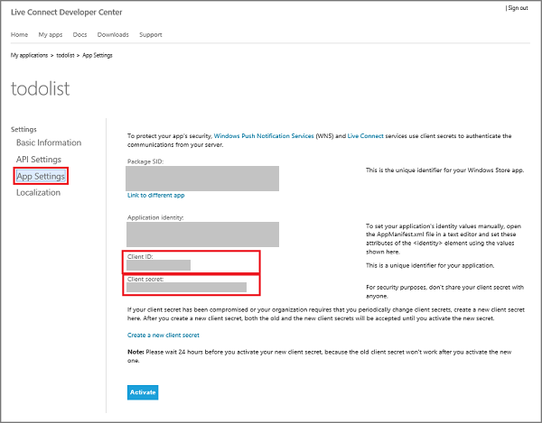
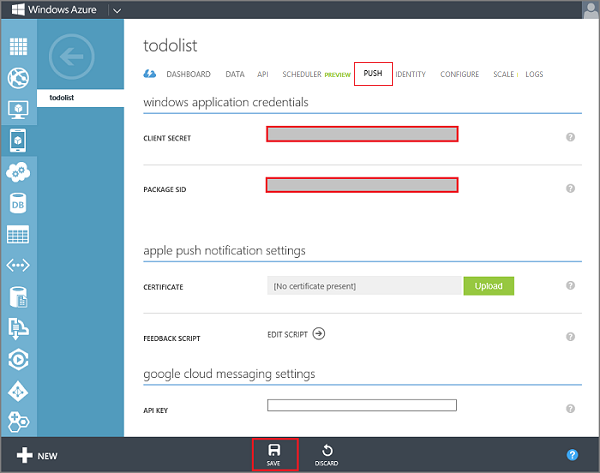

1. If you have not already registered your app, navigate to the [Submit an app page] at the Dev Center for Windows Store apps, log on with your Microsoft account, and then click **App name**.

   	

2. Type a name for your app in **App name**, click **Reserve app name**, and then click **Save**.

   	

   	This creates a new Windows Store registration for your app.

3. In Visual Studio, open the project that you created when you completed the tutorial **Get started with Mobile Services**.

4. In solution explorer, right-click the project, click **Store**, and then click **Associate App with the Store...**. 

  	

   	This displays the **Associate Your App with the Windows Store** Wizard.

5. In the wizard, click **Sign in** and then login with your Microsoft account.

6. Select the app that you registered in step 2, click **Next**, and then click **Associate**.

   	

   	This adds the required Windows Store registration information to the application manifest.    

7. (Optional) Repeat steps 4-6 to also register the Windows Phone Store project of a universal Windows app.

8. Back in the Windows Dev Center page for your new app, click **Services**. 

   	 

9. In the Services page, click **Live Services site** under **Azure Mobile Services**.

	

10. Click **Authenticating your service** and make a note of the values of **Client secret** and **Package security identifier (SID)**. 

   	

    > [AZURE.NOTE] The client secret and package SID are important security credentials. Do not share these secrets with anyone or distribute them with your app.

11. Log on to the [Azure Management Portal], click **Mobile Services**, and then click your app.

   	

12. Click the **Push** tab and enter the **Client secret** and **Package SID** values obtained from WNS, then click **Save**.

	>[AZURE.NOTE]When you are completing this tutorial using an older mobile service, you might see a link at the bottom of the **Push** tab that says **Enable Enhanced Push**. Click this now to upgrade your mobile service to integrate with Notification Hubs. This change cannot be reverted. For details on how to enable enhanced push notifications in a production mobile service, see <a href="http://go.microsoft.com/fwlink/p/?LinkId=391951">this guidance</a>. 

   	

	>[AZURE.NOTE]When you set your WNS credentials for enhanced push notifications in the **Push** tab in the portal, they are shared with Notification Hubs to configure the notification hub for your app.

<!-- URLs. -->
[Get started with Mobile Services]: ../articles/mobile-services-windows-store-get-started.md
[Submit an app page]: http://go.microsoft.com/fwlink/p/?LinkID=266582
[Azure Management Portal]: https://manage.windowsazure.com/
