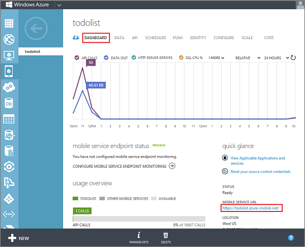

To be able to authenticate users, you must register your app with an identity provider. You must then register the provider-generated client secret with Mobile Services.

1. Log on to the [Azure Management Portal], click **Mobile Services**, and then click your mobile service.

   	

2. Click the **Dashboard** tab and make a note of the **Mobile Service URL** value.

   	

    You may need to provide this value to the identity provider when you register your app.

3. Choose a supported identity provider from the list below and follow the steps to register your app with that provider:

 - <a href="/en-us/develop/mobile/how-to-guides/register-for-microsoft-authentication/" target="_blank">Microsoft Account</a>
 - <a href="/en-us/develop/mobile/how-to-guides/register-for-facebook-authentication/" target="_blank">Facebook login</a>
 - <a href="/en-us/develop/mobile/how-to-guides/register-for-twitter-authentication/" target="_blank">Twitter login</a>
 - <a href="/en-us/develop/mobile/how-to-guides/register-for-google-authentication/" target="_blank">Google login</a>
 - <a href="/en-us/documentation/articles/mobile-services-how-to-register-active-directory-authentication/" target="_blank">Azure Active Directory</a>

    Remember to make a note of the client identity and secret values generated by the provider.

    
<b>Security Note</b>
	
The provider-generated secret is an important security credential. Do not share this secret with anyone or distribute it with your app.

    

4. Back in the Management Portal, click the **Identity** tab, enter the app identifier and shared secret values obtained from your identity provider, and click **Save**.

   	

	Both your mobile service and your app are now configured to work with your chosen authentication provider.

<!-- URLs. -->
[Azure Management Portal]: https://manage.windowsazure.com/