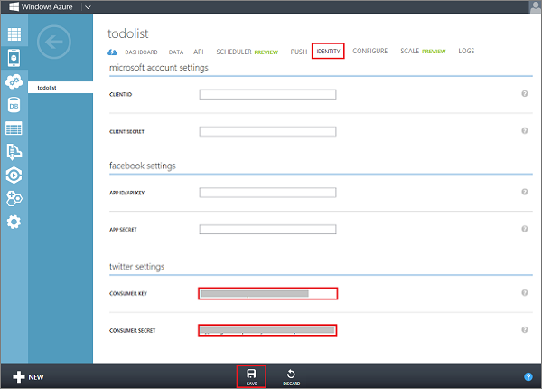
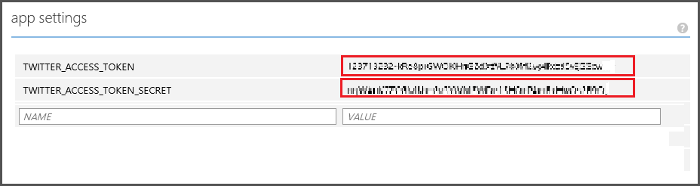

The new Twitter v1.1 APIs requires your app to authenticate before accessing resources. First, you need to get the credentials needed to request access by using OAuth 2.0. Then, you will store them securely in the app settings for your mobile service.

1. If you haven't already done so, complete the steps in the topic <a href="../articles/mobile-services/mobile-services-how-to-register-twitter-authentication.md/" target="_blank">Register your apps for Twitter login with Mobile Services</a>. 
  
  	Twitter generates the credentials needed to enable you to access Twitter v1.1 APIs. You can get these credentials from the Twitter Developers website. 

2. Navigate to the <a href="http://go.microsoft.com/fwlink/p/?LinkId=268300" target="_blank">Twitter Developers</a> website, sign-in with your Twitter account credentials and select your Twitter app.

3. In the **Keys and Access Tokens** tab for the app, make a note of the following values:

	+ **Consumer key**
	+ **Consumer secret**
	+ **Access token**
	+ **Access token secret**

4. Log on to the [Azure Management Portal], click **Mobile Services**, and then click your mobile service.

5. Click the **Identity** tab, enter the **Consumer key** and **Consumer secret** values obtained from Twitter, and click **Save**. 

	

2. Click the **Configure** tab, scroll down to **App settings** and enter a **Name** and **Value** pair for each of the following that you obtained from the Twitter site, then click **Save**.

	+ `TWITTER_ACCESS_TOKEN`
	+ `TWITTER_ACCESS_TOKEN_SECRET`

	

	This stores the Twitter access token in app settings. Like the consumer credentials on the **Identity** tab, the access credentials are also stored encrypted in app settings, and you can access them in your server scripts without hard-coding them in the script file. For more information, see [App settings].

<!-- URLs. -->
[Mobile Services server script reference]: http://go.microsoft.com/fwlink/?LinkId=262293
[Azure Management Portal]: https://manage.windowsazure.com/
[Register your apps for Twitter login with Mobile Services]: ../articles/mobile-services/mobile-services-how-to-register-twitter-authentication.md
[Twitter Developers]: http://go.microsoft.com/fwlink/p/?LinkId=268300
[App settings]: http://msdn.microsoft.com/library/azure/b6bb7d2d-35ae-47eb-a03f-6ee393e170f7