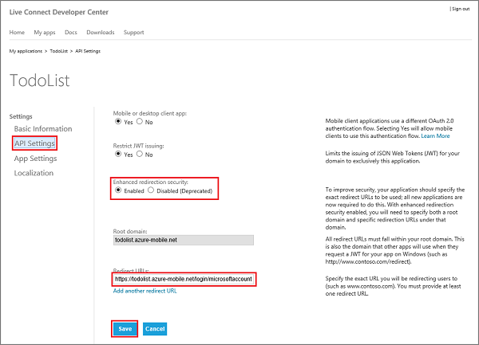
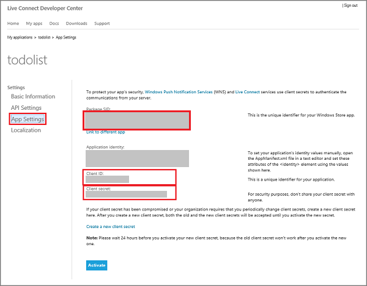
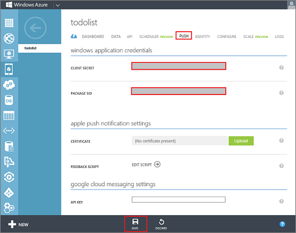
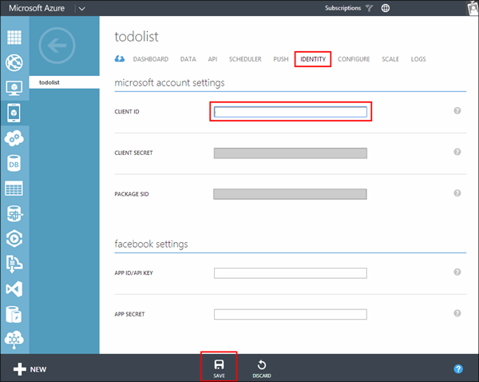

1. If you have not already registered your app, navigate to the [Submit an app page] at the Dev Center for Windows Store apps, log on with your Microsoft account, and then click **App name**.

   	

2. Select **Create a new app by reserving a unique name** and click **Continue**, then type a name for your app in **App name**, click **Reserve app name**, and then click **Save**.

   	

   	This creates a new Windows Store registration for your app.

3. In Visual Studio, open the project that you created when you completed the tutorial [Get started with Mobile Services].

4. In solution explorer, right-click the Windows Store app project, click **Store**, and then click **Associate App with the Store...**. 

  	

   	This displays the **Associate Your App with the Windows Store** Wizard.

5. In the wizard, click **Sign in** and then login with your Microsoft account, select the app that you registered in step 2, click **Next**, and then click **Associate**.

   	This adds the required Windows Store registration information to the application manifest.   

6. (Optional) For a universal Windows app, repeat steps 4 and 5 for the Windows Phone Store project. 

6. Back in the Windows Dev Center page for your new app, click **Services**. 

   	 

7. In the Services page, click **Live Services site** under **Azure Mobile Services**.

	 

8. Click **API Settings**, select enable **Mobile or desktop client app**, supply the mobile service URL as the **Target domain**, supply a value of `https://<mobile_service>.azure-mobile.net/login/microsoftaccount/` in **Redirect URL**, then click **Save**.

	

9. In **App settings**, make a note of the values of **Client ID**, **Client secret**, and **Package security identifier (SID)**. 

   	

    >[AZURE.NOTE]The client secret and package SID are important security credentials. Do not share these secrets with anyone or distribute them with your app.

10. Log on to the [Azure Management Portal], click **Mobile Services**, and then click your app.

11. Click the **Identity** tab, enter the **Client Secret** and **Package SID** values obtained from WNS in Step 4, and then click **Save**.

   	

13. Click the **Identity** tab. Notice the **Client Secret** and **Package SID** values are already set from the previous step. Enter the **Client ID** you previously made note of, and then click **Save**.

   	
 
You are now ready to use a Microsoft account for authentication in your app.  

<!-- Anchors. -->

<!-- Images. -->
 

<!-- URLs. -->
[Get started with Mobile Services]: /develop/mobile/tutorials/get-started/#create-new-service
[Submit an app page]: http://go.microsoft.com/fwlink/p/?LinkID=266582
[Azure Management Portal]: https://manage.windowsazure.com/
