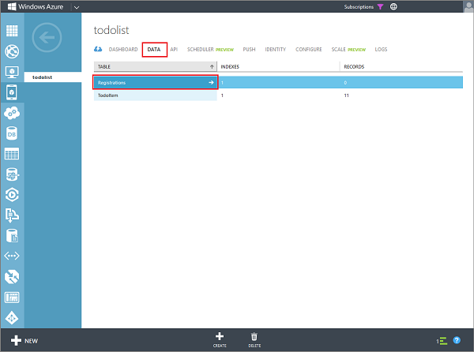

1. In the Management Portal, click the **Data** tab and then click the **Registrations** table. 

	

2. In **Registrations**, click the **Script** tab and select **Insert**.
   
	

	This displays the function that is invoked when an insert occurs in the **Registrations** table.

3. Replace the insert function with the following code, and then click **Save**:

		function insert(item, user, request) {
			var registrationTable = tables.getTable('Registrations');
			registrationTable
				.where({ handle: item.handle })
				.read({ success: insertChannelIfNotFound });
	        function insertChannelIfNotFound(existingRegistrations) {
        	    if (existingRegistrations.length > 0) {
            	    request.respond(200, existingRegistrations[0]);
        	    } else {
            	    request.execute();
        	    }
    	    }
	    }

   This registers a new insert script, which stores the registration information in the new table.

