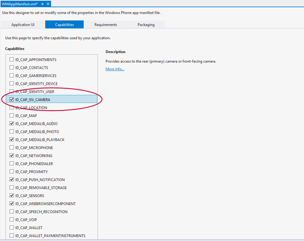
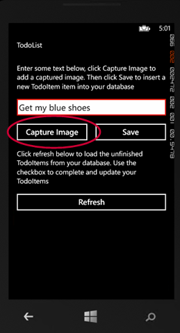
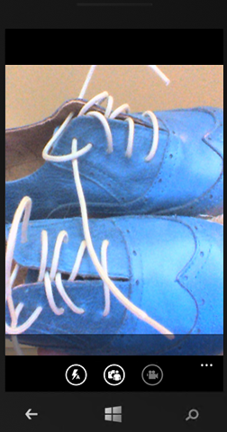
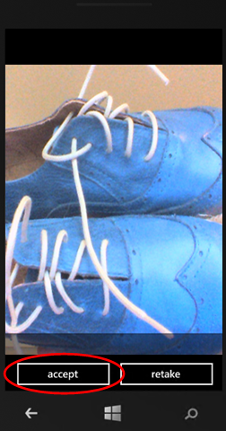
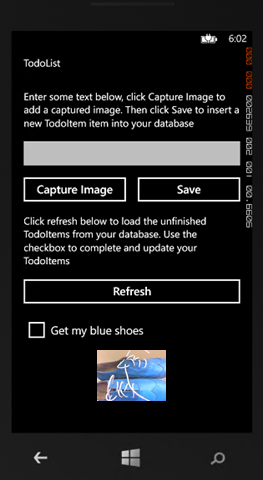

##Update the quickstart client app to capture and upload images

In this section you will update the project from the [Get started with Mobile Services] tutorial to take photos and upload them to Azure Blob Storage. To capture the image, this tutorial uses the [CameraCaptureTask] from the `Microsoft.Phone.Tasks` namespace. This class launches the camera UI on the Windows Phone device to capture the photo and automatically saves the image to the Camera Roll on the Windows Phone device. If you do not want the images saved to the Camera Roll, use the [PhotoCamera] class in the `Microsoft.Devices` namespace instead.

1. In the Solution Explorer for Visual Studio, under the project, expand **Properties**. Then open the WMAppManifest.xml file and on the **Capabilities** tab enable the camera by clicking **ID\_CAP\_ISV\_CAMERA**. Close the file to save your change.

   	

   	This makes sure that your app can use a camera attached to the computer. Users will be requested to allow camera access the first time that the app is run.

2. Open the MainPage.xaml file and replace the **Grid** element named **ContentPanel** with the following code:

        <!--ContentPanel - place additional content here-->
        <Grid x:Name="ContentPanel" Grid.Row="1" Margin="12,0,12,0">
            <Grid.RowDefinitions>
                <RowDefinition Height="Auto" />
                <RowDefinition Height="Auto" />
                <RowDefinition Height="Auto" />
                <RowDefinition Height="Auto" />
                <RowDefinition Height="Auto" />
                <RowDefinition Height="*" />
            </Grid.RowDefinitions>
            <Grid.ColumnDefinitions>
                <ColumnDefinition Width="2*" />
                <ColumnDefinition Width="2*" />
            </Grid.ColumnDefinitions>
            <TextBlock Grid.Row="0" Grid.ColumnSpan="2" Text="Enter some text below, click Capture Image to add a captured image. Then click Save to insert a new TodoItem item into your database" TextWrapping="Wrap" Margin="12"/>
            <TextBox Grid.Row="1" Grid.ColumnSpan="2" Name="TextInput" Text="" />
            <Button Name="ButtonCaptureImage" Grid.Row="2" Click="ButtonCaptureImage_Click">Capture Image</Button>
            <Button Grid.Row ="2" Grid.Column="1" Name="ButtonSave" Click="ButtonSave_Click">Save</Button>
            <TextBlock Grid.Row="3" Grid.ColumnSpan="2" Text="Click refresh below to load the unfinished TodoItems from your database. Use the checkbox to complete and update your TodoItems" TextWrapping="Wrap" Margin="12" />
            <Button Grid.Row="4" Grid.ColumnSpan="2" Name="ButtonRefresh" Click="ButtonRefresh_Click">Refresh</Button>
            <phone:LongListSelector Grid.Row="5" Grid.ColumnSpan="2" Name="ListItems">
                <phone:LongListSelector.ItemTemplate>
                    <DataTemplate>
                        <StackPanel Orientation="Vertical">
                            <CheckBox Name="CheckBoxComplete" IsChecked="{Binding Complete, Mode=TwoWay}" Checked="CheckBoxComplete_Checked" Content="{Binding Text}" Margin="10,5" VerticalAlignment="Center"/>
                            <Image Name="ImageUpload" Source="{Binding ImageUri, Mode=OneWay}" MaxHeight="150"/>
                        </StackPanel>
                    </DataTemplate>
                </phone:LongListSelector.ItemTemplate>
            </phone:LongListSelector>
        </Grid>

   	This adds a new button to launch the [CameraCaptureTask] and adds an image to the **ItemTemplate** and sets its binding source as the URI of the uploaded image in the Blob Storage service.

3. Open the MainPage.xaml.cs project file and add the following **using** statements:
	
		using Microsoft.Phone.Tasks;
		using System.IO;
		using Microsoft.WindowsAzure.Storage.Auth;
		using Microsoft.WindowsAzure.Storage.Blob;
    
4. In the MainPage.xaml.cs project file, update the TodoItem class by adding the following properties:

        [JsonProperty(PropertyName = "containerName")]
        public string ContainerName { get; set; }
		
        [JsonProperty(PropertyName = "resourceName")]
        public string ResourceName { get; set; }
		
        [JsonProperty(PropertyName = "sasQueryString")]
        public string SasQueryString { get; set; }
		
        [JsonProperty(PropertyName = "imageUri")]
        public string ImageUri { get; set; } 

5. In the MainPage.xaml.cs project file, update the MainPage class. Add the following code to declare the [CameraCaptureTask] and a stream object that will reference the captured image:

        // Using the CameraCaptureTask to allow the user to capture a todo item image //
        CameraCaptureTask cameraCaptureTask;
		
        // Using a stream reference to upload the image to blob storage.
        Stream imageStream = null;

6. In the MainPage.xaml.cs project file, update the MainPage class. Add the following code to update the constructor to create the CameraCaptureTask and add an event handler for the Completed event:

        // Constructor
        public MainPage()
        {
            InitializeComponent();
			
            cameraCaptureTask = new CameraCaptureTask();
            cameraCaptureTask.Completed += cameraCaptureTask_Completed;
        }
		
        void cameraCaptureTask_Completed(object sender, PhotoResult e)
        {
            imageStream = e.ChosenPhoto;
        }

7. In the MainPage.xaml.cs project file, update the MainPage class. Add the following code that displays the camera UI to allow the user to capture an image when the **Capture Image** button is clicked:

        private void ButtonCaptureImage_Click(object sender, RoutedEventArgs e)
        {
            cameraCaptureTask.Show();
        }

8. In the MainPage.xaml.cs project file, update the MainPage class. Replace the existing `InsertTodoItem` method with the following code:
 
        private async void InsertTodoItem(TodoItem todoItem)
        {
            string errorString = string.Empty;            
			
            if (imageStream != null)
            {
                // Set blob properties of TodoItem.
                todoItem.ContainerName = "todoitemimages";
                todoItem.ResourceName = Guid.NewGuid().ToString() + ".jpg";
            }                       
			
            // Send the item to be inserted. When blob properties are set this
            // generates an SAS in the response.
            await todoTable.InsertAsync(todoItem);  
			
            // If we have a returned SAS, then upload the blob.
            if (!string.IsNullOrEmpty(todoItem.SasQueryString))
            {
                // Get the URI generated that contains the SAS 
                // and extract the storage credentials.
                StorageCredentials cred = new StorageCredentials(todoItem.SasQueryString);
                var imageUri = new Uri(todoItem.ImageUri);
				
                // Instantiate a Blob store container based on the info in the returned item.
                CloudBlobContainer container = new CloudBlobContainer(
                    new Uri(string.Format("https://{0}/{1}",
                        imageUri.Host, todoItem.ContainerName)), cred);                
				
                // Upload the new image as a BLOB from the stream.
                CloudBlockBlob blobFromSASCredential =
                    container.GetBlockBlobReference(todoItem.ResourceName);
                await blobFromSASCredential.UploadFromStreamAsync(imageStream);
				
				// When you request an SAS at the container-level instead of the blob-level,
				// you are able to upload multiple streams using the same container credentials.

                imageStream = null;
            }              
			
            // Add the new item to the collection.
            items.Add(todoItem);
            TextInput.Text = "";
        }

	This code sends a request to the mobile service to insert a new TodoItem, including the image file name. The response contains the SAS, which is then used to insert the image in the Blob store, and the URI of the image for data binding.

The final step is to test the app and validate that uploads succeed.
		
##Test uploading the images in your app

1. In Visual Studio, you can press the F5 key to test the app in the emulator or with an actual device targeted.

2. Enter some text in the textbox, then click **Capture Image**.

   	

  	This displays the camera capture UI. 

3. Click the image or the snapshot button on the phone to take a picture.
  
   	

4. Click **accept** to accept the image and exit the camera UI.

    

5. Click **Save** to insert the new item and upload the image.

	

6. The new item, along with the uploaded image, is displayed in the list view.

	

   >[AZURE.NOTE]The image is downloaded automatically from the Blob Storage service when the <code>imageUri</code> property of the new item is bound to the <strong>Image</strong> control.

[Get started with Mobile Services]: ../articles/mobile-services-windows-phone-get-started.md
[CameraCaptureTask]: http://msdn.microsoft.com/library/windowsphone/develop/microsoft.phone.tasks.cameracapturetask(v=vs.105).aspx
[PhotoCamera]: http://msdn.microsoft.com/library/windowsphone/develop/microsoft.devices.photocamera(v=vs.105).aspx
