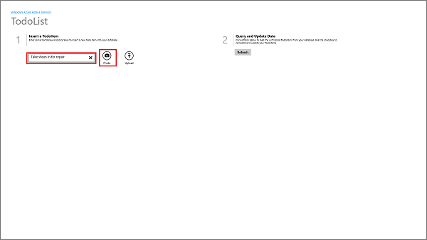
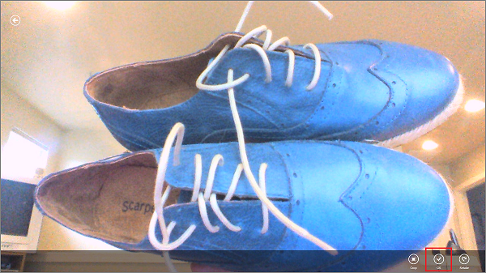
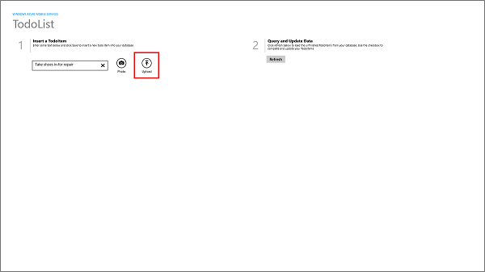

##Update the quickstart client app to capture and upload images

1. In Visual Studio, open the Package.appxmanifest file and in the **Capabilities** tab enable the **Webcam** and **Microphone** capabilities.

   	
 
   	This makes sure that your app can use a camera attached to the computer. Users will be requested to allow camera access the first time that the app is run.

1. Open the MainPage.xaml file and replace the **StackPanel** element directly after the first **Task** element with the following code:

        <StackPanel Orientation="Horizontal" Margin="72,0,0,0">
            <TextBox Name="TextInput" Margin="5" MaxHeight="40" MinWidth="300"></TextBox>
            <Button Name="btnTakePhoto" Style="{StaticResource PhotoAppBarButtonStyle}"
                    Click="OnTakePhotoClick" />
            <Button Name="ButtonSave" Style="{StaticResource UploadAppBarButtonStyle}" 
                    Click="ButtonSave_Click"/>
        </StackPanel>

2. Replace the **StackPanel** element in the **DataTemplate** with the following code:

        <StackPanel Orientation="Vertical">
            <CheckBox Name="CheckBoxComplete" IsChecked="{Binding Complete, Mode=TwoWay}" 
                        Checked="CheckBoxComplete_Checked" Content="{Binding Text}" 
                        Margin="10,5" VerticalAlignment="Center"/>
            <Image Name="ImageUpload" Source="{Binding ImageUri, Mode=OneWay}"
                    MaxHeight="250"/>
        </StackPanel> 

   	This adds an image to the **ItemTemplate** and sets its binding source as the URI of the uploaded image in the Blob Storage service.

3. Open the MainPage.xaml.cs project file and add the following **using** statements:
	
		using Windows.Media.Capture;
		using Windows.Storage;
		using Windows.UI.Popups;
		using Microsoft.WindowsAzure.Storage.Auth;
		using Microsoft.WindowsAzure.Storage.Blob;
    
4. In the TodoItem class, add the following properties:

        [JsonProperty(PropertyName = "containerName")]
        public string ContainerName { get; set; }
		
        [JsonProperty(PropertyName = "resourceName")]
        public string ResourceName { get; set; }
		
        [JsonProperty(PropertyName = "sasQueryString")]
        public string SasQueryString { get; set; }
		
        [JsonProperty(PropertyName = "imageUri")]
        public string ImageUri { get; set; } 

   	>[AZURE.NOTE]To add new properties to the TodoItem object, you must have Dynamic Schema enabled in your mobile service. When Dynamic Schema is enabled, new columns are automatically added to the TodoItem table that map to these new properties.

5. In the MainPage class, add the following code:

        // Use a StorageFile to hold the captured image for upload.
        StorageFile media = null;
		
		private async void OnTakePhotoClick(object sender, RoutedEventArgs e)
		{
			// Capture a new photo or video from the device.
			CameraCaptureUI cameraCapture = new CameraCaptureUI();
			media = await cameraCapture
				.CaptureFileAsync(CameraCaptureUIMode.PhotoOrVideo);
        }

  	This code displays the camera UI to capture an image, and saves the image to a storage file.

6. Replace the existing `InsertTodoItem` method with the following code:
 
        private async void InsertTodoItem(TodoItem todoItem)
        {
            string errorString = string.Empty;
			
            if (media != null)
            {
                // Set blob properties of TodoItem.
                todoItem.ContainerName = "todoitemimages";
                todoItem.ResourceName = media.Name;
            }
			
            // Send the item to be inserted. When blob properties are set this
            // generates an SAS in the response.
            await todoTable.InsertAsync(todoItem);
			
            // If we have a returned SAS, then upload the blob.
            if (!string.IsNullOrEmpty(todoItem.SasQueryString))
            {
                // Get the URI generated that contains the SAS 
                // and extract the storage credentials.
                StorageCredentials cred = new StorageCredentials(todoItem.SasQueryString);
                var imageUri = new Uri(todoItem.ImageUri);
				
                // Instantiate a Blob store container based on the info in the returned item.
                CloudBlobContainer container = new CloudBlobContainer(
                    new Uri(string.Format("https://{0}/{1}",
                        imageUri.Host, todoItem.ContainerName)), cred);

                // Get the new image as a stream.
                using (var fileStream = await media.OpenStreamForReadAsync())
                {                   					
                    // Upload the new image as a BLOB from the stream.
                    CloudBlockBlob blobFromSASCredential =
                        container.GetBlockBlobReference(todoItem.ResourceName);
                    await blobFromSASCredential.UploadFromStreamAsync(fileStream.AsInputStream());
                }
				
				// When you request an SAS at the container-level instead of the blob-level,
				// you are able to upload multiple streams using the same container credentials.
            }
			
            // Add the new item to the collection.
            items.Add(todoItem);
        }

	This code sends a request to the mobile service to insert a new TodoItem, including the image file name. The response contains the SAS, which is then used to insert the image in the Blob store, and the URI of the image for data binding.

The final step is to test the app and validate that uploads succeed.
		
##Test uploading the images in your app

1. In Visual Studio, press the F5 key to run the app.

2. Enter text in the textbox under **Insert a TodoItem**, then click **Photo**.

   	

  	This displays the camera capture UI. 

3. Click the image to take a picture, then click **OK**.
  
   	

4. Click **Upload** to insert the new item and upload the image.

	

5. The new item, along with the uploaded image, is displayed in the list view.

	

   	>[AZURE.NOTE]The image is downloaded automatically from the Blob Storage service when the <code>imageUri</code> property of the new item is bound to the <strong>Image</strong> control.

