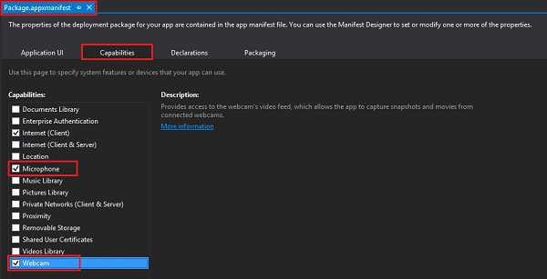
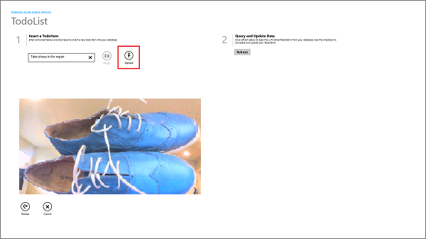
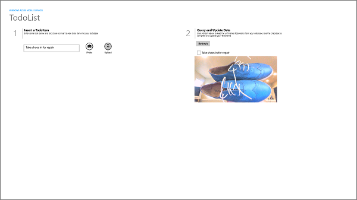
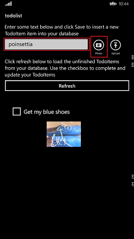
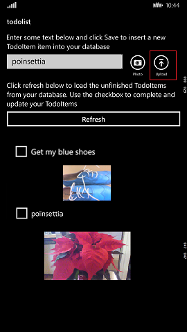

##Install the Storage client for Windows Store apps

To be able to use an SAS to upload images to Blob storage, you must first add the NuGet package that installs Storage client library for Windows Store apps.

1. In **Solution Explorer** in Visual Studio, right-click the project name, and then select **Manage NuGet Packages**.

2. In the left pane, select the **Online** category, search for `WindowsAzure.Storage`, click **Install** on the **Azure Storage** package, then accept the license agreements. 

  	

  	This adds the client library for Azure storage services to the project.

Next, you will update the quickstart app to capture and upload images.

##Update the quickstart client app to capture and upload images

1. In Visual Studio, open the Package.appxmanifest file for the Windows app project and in the **Capabilities** tab enable the **Webcam** and **Microphone** capabilities.

   	
 
   	This makes sure that your app can use a camera attached to the computer. Users will be requested to allow camera access the first time that the app is run.

2. Repeat the step above for the Windows Phone app project.
 
3. In the Windows app project, open the MainPage.xaml file and replace the **StackPanel** element directly after the first **QuickStartTask** element with the following code:

		<StackPanel Orientation="Horizontal" Margin="72,0,0,0">
            <TextBox Name="TextInput" Margin="5" MaxHeight="40" MinWidth="300"></TextBox>
            <AppBarButton Label="Photo" Icon="Camera" Name="ButtonCapture" Click="ButtonCapture_Click" />
            <AppBarButton Label="Upload" Icon="Upload" Name="ButtonSave" Click="ButtonSave_Click"/>
        </StackPanel>
        <Grid Name="captureGrid" Margin="62,0,0,0" Visibility="Collapsed" >
            <Grid.RowDefinitions>
                <RowDefinition Height="*" />
                <RowDefinition Height="Auto" />
            </Grid.RowDefinitions>
            <CaptureElement x:Name="previewElement" Grid.Row="0" Tapped="previewElement_Tapped" />
            <Image Name="imagePreview" Grid.Row="0"  />
            <StackPanel Name="captureButtons" Orientation="Horizontal" Grid.Row="1">
                <TextBlock Name="TextCapture" />
                <AppBarButton Label="Retake" Icon="Redo" Name="ButtonRetake" Click="ButtonCapture_Click" />
                <AppBarButton Label="Cancel" Icon="Cancel" Name="ButtonCancel" Click="ButtonCancel_Click" />
            </StackPanel>
        </Grid>

2. Replace the **StackPanel** element in the **DataTemplate** with the following code:

        <StackPanel Orientation="Vertical">
            <CheckBox Name="CheckBoxComplete" IsChecked="{Binding Complete, Mode=TwoWay}" 
                        Checked="CheckBoxComplete_Checked" Content="{Binding Text}" 
                        Margin="10,5" VerticalAlignment="Center"/>
            <Image Name="ImageUpload" Source="{Binding ImageUri, Mode=OneWay}"
                    MaxHeight="250"/>
        </StackPanel> 

   	This adds an image to the **ItemTemplate** and sets its binding source as the URI of the uploaded image in the Blob Storage service.

3. In the Windows Phone app project, open the MainPage.xaml file and replace the **ButtonSave** element with the following code:

        <StackPanel Grid.Row ="1" Grid.Column="1"  Orientation="Horizontal">
            <AppBarButton Label="Photo" Icon="Camera" Name="ButtonCapture" 
                          Click="ButtonCapture_Click" Height="78" Width="62" />
            <AppBarButton Label="Upload" Icon="Upload" Name="ButtonSave" 
                          Click="ButtonSave_Click"/>
        </StackPanel>
        <Grid Grid.Row="2" Name="captureGrid" Grid.RowSpan="3" Grid.ColumnSpan="2" 
              Canvas.ZIndex="99" Background="{ThemeResource ApplicationPageBackgroundThemeBrush}" 
              Visibility="Collapsed">
            <Grid.RowDefinitions>
                <RowDefinition Height="*" />
                <RowDefinition Height="Auto" />
            </Grid.RowDefinitions>
            <CaptureElement Grid.Row="0" x:Name="previewElement" Tapped="previewElement_Tapped" />                    
            <Image Grid.Row="0" Name="imagePreview" Visibility="Collapsed" />
            <StackPanel Grid.Row="1" Name="captureButtons" 
                        Orientation="Horizontal" Visibility="Collapsed">
                <TextBlock Name="TextCapture" VerticalAlignment="Bottom" />
                <AppBarButton Label="Retake" Icon="Redo" Name="ButtonRetake" 
                              Click="ButtonRetake_Click" />
                <AppBarButton Label="Cancel" Icon="Cancel" Name="ButtonCancel" 
                              Click="ButtonCancel_Click" />
            </StackPanel>
        </Grid>

2. Replace the **StackPanel** element in the **DataTemplate** with the following code:

        <StackPanel Orientation="Vertical">
            <CheckBox Name="CheckBoxComplete" IsChecked="{Binding Complete, Mode=TwoWay}" 
                      Checked="CheckBoxComplete_Checked" Content="{Binding Text}" 
                      Margin="10,5" VerticalAlignment="Center"/>
            <Image Name="ImageUpload" Source="{Binding ImageUri, Mode=OneWay}" 
                   MaxHeight="150"/>
        </StackPanel>

4. In the shared DataModel folder, open the TodoItem.cs project file and add add the following properties to the TodoItem class:

        [JsonProperty(PropertyName = "containerName")]
        public string ContainerName { get; set; }
		
        [JsonProperty(PropertyName = "resourceName")]
        public string ResourceName { get; set; }
		
        [JsonProperty(PropertyName = "sasQueryString")]
        public string SasQueryString { get; set; }
		
        [JsonProperty(PropertyName = "imageUri")]
        public string ImageUri { get; set; } 

3. Open the shared MainPage.cs project file and add the following **using** statements:
	
		using Windows.Media.Capture;
		using Windows.Media.MediaProperties;
		using Windows.Storage;
		using Windows.UI.Xaml.Input;
		using Microsoft.WindowsAzure.Storage.Auth;
		using Microsoft.WindowsAzure.Storage.Blob;
		using Windows.UI.Xaml.Media.Imaging;

5. Add the following code to the MainPage class:

        // Use a StorageFile to hold the captured image for upload.
        StorageFile media = null;
        MediaCapture cameraCapture;
        bool IsCaptureInProgress;

        private async Task CaptureImage()
        {
            // Capture a new photo or video from the device.
            cameraCapture = new MediaCapture();
            cameraCapture.Failed += cameraCapture_Failed;

            // Initialize the camera for capture.
            await cameraCapture.InitializeAsync();

            #if WINDOWS_PHONE_APP
            cameraCapture.SetPreviewRotation(VideoRotation.Clockwise90Degrees);
            cameraCapture.SetRecordRotation(VideoRotation.Clockwise90Degrees);
            #endif

            captureGrid.Visibility = Windows.UI.Xaml.Visibility.Visible;
            previewElement.Visibility = Windows.UI.Xaml.Visibility.Visible;
            previewElement.Source = cameraCapture;
            await cameraCapture.StartPreviewAsync();
        }

        private async void previewElement_Tapped(object sender, TappedRoutedEventArgs e)
        {
            // Block multiple taps.
            if (!IsCaptureInProgress)
            {                
                IsCaptureInProgress = true;

                // Create the temporary storage file.
                media = await ApplicationData.Current.LocalFolder
                    .CreateFileAsync("capture_file.jpg", CreationCollisionOption.ReplaceExisting);

                // Take the picture and store it locally as a JPEG.
                await cameraCapture.CapturePhotoToStorageFileAsync(
                    ImageEncodingProperties.CreateJpeg(), media);

                captureButtons.Visibility = Visibility.Visible;

				// Use the stored image as the preview source.
                BitmapImage tempBitmap = new BitmapImage(new Uri(media.Path));
                imagePreview.Source = tempBitmap;
                imagePreview.Visibility = Visibility.Visible;
                previewElement.Visibility = Visibility.Collapsed;
                IsCaptureInProgress = false;
            }
        }

        private async void cameraCapture_Failed(MediaCapture sender, MediaCaptureFailedEventArgs errorEventArgs)
        {
            // It's safest to return this back onto the UI thread to show the message dialog.
            MessageDialog dialog = new MessageDialog(errorEventArgs.Message);
            await this.Dispatcher.RunAsync(Windows.UI.Core.CoreDispatcherPriority.Normal, 
                async () => { await dialog.ShowAsync(); });            
        }

        private async void ButtonCapture_Click(object sender, RoutedEventArgs e)
        {
            // Prevent multiple initializations.
            ButtonCapture.IsEnabled = false;

            await CaptureImage();
        }

        private async void ButtonRetake_Click(object sender, Windows.UI.Xaml.RoutedEventArgs e)
        {
            // Reset the capture and then start again.
            await ResetCaptureAsync();
            await CaptureImage();
        }

        private async void ButtonCancel_Click(object sender, Windows.UI.Xaml.RoutedEventArgs e)
        {
            await ResetCaptureAsync();
        }

        private async Task ResetCaptureAsync()
        {
            captureGrid.Visibility = Windows.UI.Xaml.Visibility.Collapsed;
            imagePreview.Visibility = Visibility.Collapsed;
            captureButtons.Visibility = Visibility.Collapsed;
            previewElement.Source = null;
            ButtonCapture.IsEnabled = true;

            // Make sure we stop the preview and release resources.
            await cameraCapture.StopPreviewAsync();
            cameraCapture.Dispose();
            media = null;
        }

  	This code displays the UI used to capture an image, and saves the image to a storage file.

6. Replace the existing `InsertTodoItem` method with the following code:
 
        private async Task InsertTodoItem(TodoItem todoItem)
        {
            string errorString = string.Empty;

            if (media != null)
            {
                // Set blob properties of TodoItem.
                todoItem.ContainerName = "todoitemimages";

                // Use a unigue GUID to avoid collisions.
                todoItem.ResourceName = Guid.NewGuid().ToString();
            }

            // Send the item to be inserted. When blob properties are set this
            // generates an SAS in the response.
            await todoTable.InsertAsync(todoItem);

            // If we have a returned SAS, then upload the blob.
            if (!string.IsNullOrEmpty(todoItem.SasQueryString))
            {
                // Get the URI generated that contains the SAS 
                // and extract the storage credentials.
                StorageCredentials cred = new StorageCredentials(todoItem.SasQueryString);
                var imageUri = new Uri(todoItem.ImageUri);

                // Instantiate a Blob store container based on the info in the returned item.
                CloudBlobContainer container = new CloudBlobContainer(
                    new Uri(string.Format("https://{0}/{1}",
                        imageUri.Host, todoItem.ContainerName)), cred);

                // Get the new image as a stream.
                using (var inputStream = await media.OpenReadAsync())
                {
                    // Upload the new image as a BLOB from the stream.
                    CloudBlockBlob blobFromSASCredential =
                        container.GetBlockBlobReference(todoItem.ResourceName);
                    await blobFromSASCredential.UploadFromStreamAsync(inputStream);
                }

                // When you request an SAS at the container-level instead of the blob-level,
                // you are able to upload multiple streams using the same container credentials.

                await ResetCaptureAsync();
            }

            // Add the new item to the collection.
            items.Add(todoItem);
        }

	This code sends a request to the mobile service to insert a new TodoItem. The response contains the SAS, which is then used to upload the image from local storage to Azure Blob storage. The URL of the uploaded image is used in data binding.

The final step is to test both versions of the app and validate that uploads succeed from both devices.
		
##Test uploading the images in your app

1. In Visual Studio, make sure that the Windows project is set as the default project, then press the F5 key to run the app.

2. Enter text in the textbox under **Insert a TodoItem**, then click **Photo**.

3. Click or tap the preview to take a picture, then click **Upload** to insert the new item and upload the image.

	

4. The new item, along with the uploaded image, is displayed in the list view.

	

   	>[AZURE.NOTE]The image is downloaded automatically from Blob storage when the *imageUri* property of the new item is bound to the **Image** control.

5. Stop the app and restart the Windows Phone project version of the app.

	The previously uploaded image is displayed.

6. As before, enter some text in the textbox, then click **Photo**.

   	

3. Tap the preview to take a picture, then click **Upload** to insert the new item and upload the image.

	

You have completed the upload images tutorial.