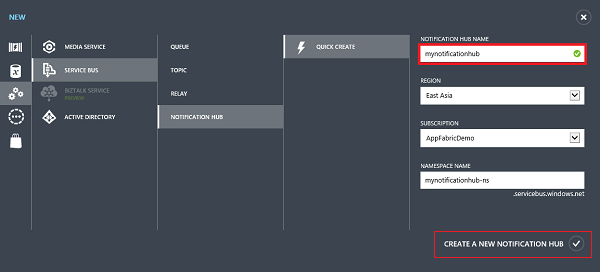
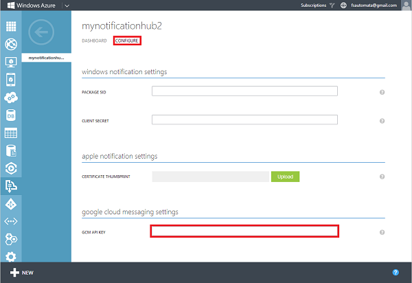

1. Log on to the [Azure Management Portal](https://manage.windowsazure.com/), and then click **+NEW** at the bottom of the screen.

2. Click on **App Services**, then **Service Bus**, then **Notification Hub**, then **Quick Create**.

3. Type a name for your notification hub, select your desired region, and then click **Create a new Notification Hub**.

   	

4. Under **Service Bus**, click the namespace you just created (usually ***notification hub name*-ns**).

5. On your namespace, click the **Notification Hubs** tab for your at the top, and then click on the notification hub you just created.

6. Click the **Configure** tab at the top, enter the **API Key** value you obtained in the previous section, and then click **Save**.

   	

7. Select the **Dashboard** tab at the top, then click **View Connection String**. Take note of the two connection strings.

Your notification hub is now configured to work with GCM, and you have the connection strings to both register your app to receive notifications and to send push notifications.
