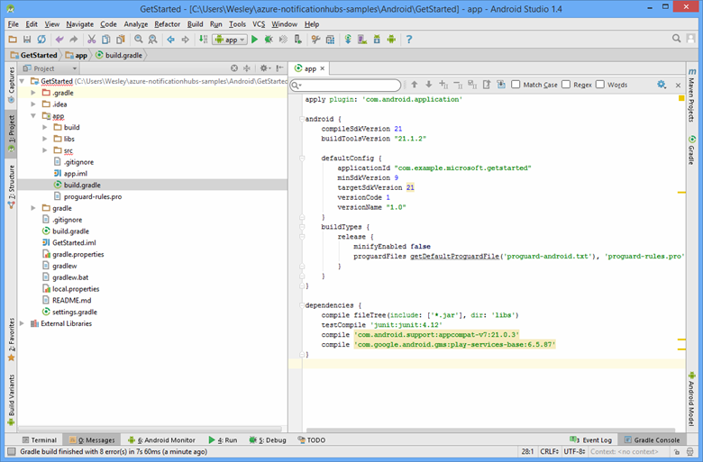

1. Open the Android SDK Manager by clicking the icon on the toolbar of Android Studio or by clicking **Tools** -> **Android** -> **SDK Manager** on the menu. Locate the target version of the Android SDK that is used in your project , open it by clicking **Show Package Details**, and choose **Google APIs**, if it is not already installed.

2. Click the **SDK Tools** tab. If you haven't already installed Google Play Service, click **Google Play Services** as shown below. Then click **Apply** to install. 
 
	Note the SDK path, for use in a later step. 

   	

3. Open the **build.gradle** file in the app directory.

	

4. Add this line under *dependencies*: 

   		compile 'com.google.android.gms:play-services-gcm:9.2.0'

5. Click the **Sync Project with Gradle Files** icon in the tool bar.

6. Open **AndroidManifest.xml** and add this tag to the *application* tag.

        <meta-data android:name="com.google.android.gms.version"
            android:value="@integer/google_play_services_version" />
 

