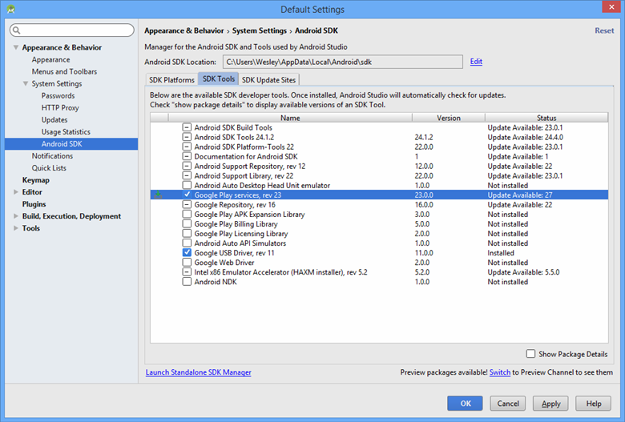
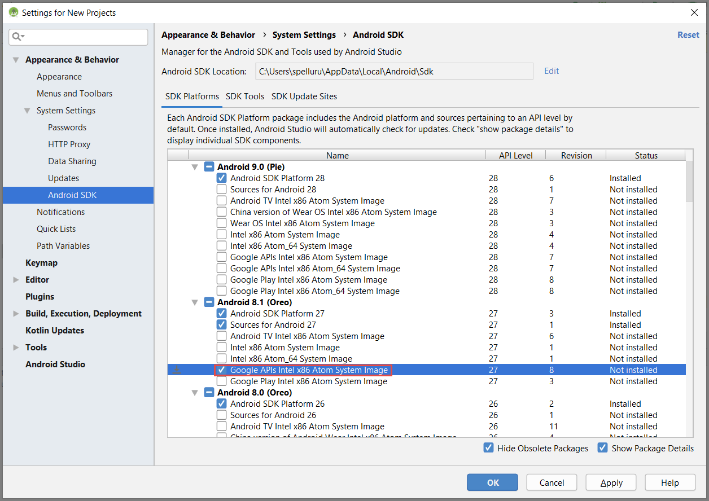
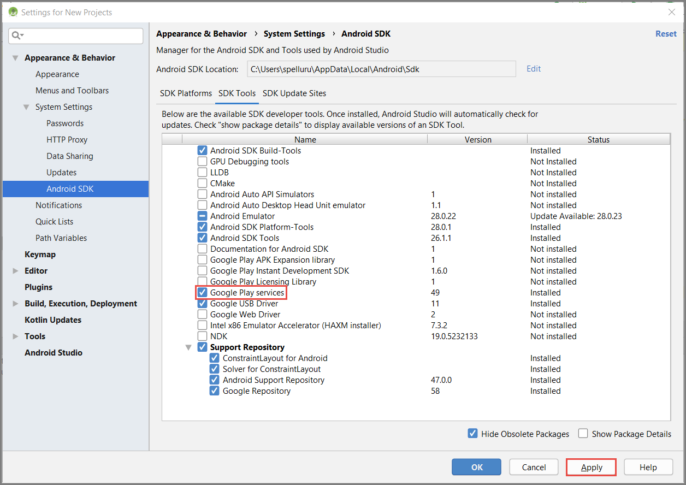
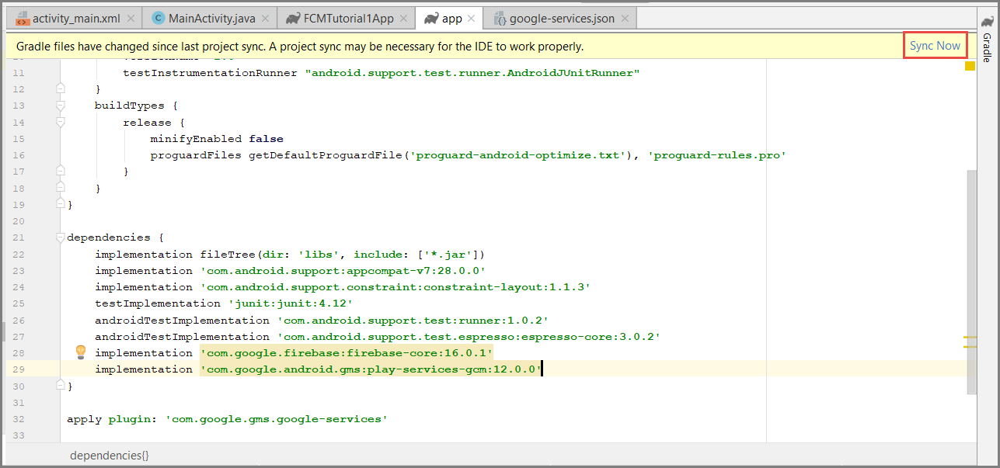

1. In Android Studio, select **Tools** on the menu, and then select **SDK Manager**. 
2. Select the target version of the Android SDK that is used in your project. Then select **Show Package Details**. 

    
3. Select **Google APIs**, if it's not already installed.

    
4. Switch to the **SDK Tools** tab. If you haven't already installed Google Play Services, select **Google Play Services** as shown in the following image. Then select **Apply** to install. Note the SDK path, for use in a later step.

    
3. If you see the **Confirm Change** dialog box, select **OK**. The Component Installer installs the requested components. Select **Finish** after the components are installed.
4. Select **OK** to close the **Settings for New Projects** dialog box.  
5. Open the build.gradle file in the **app** directory, and then add the following line under `dependencies`. 

    ```gradle
    implementation 'com.google.android.gms:play-services-gcm:16.0.0'
    ```
5. Select **Sync Now** icon in the toolbar.

    
1. Open the AndroidManifest.xml file, and then add the following tag to the *application* tag.

    ```xml
    <meta-data android:name="com.google.android.gms.version"
         android:value="@integer/google_play_services_version" />
    ```
